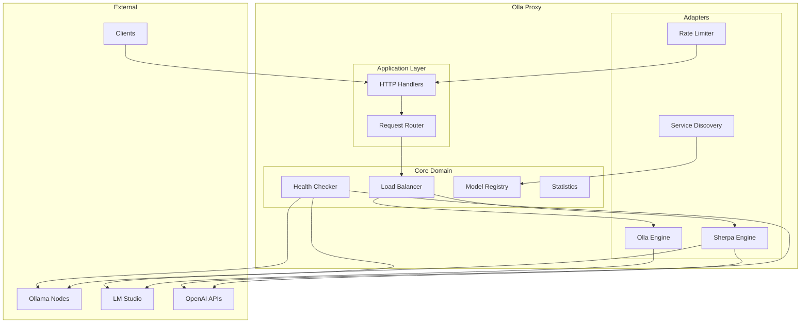
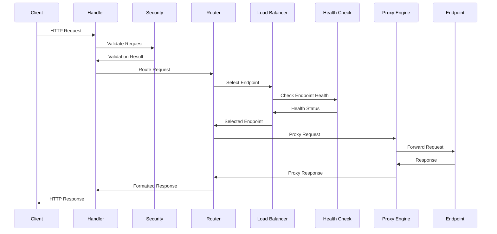
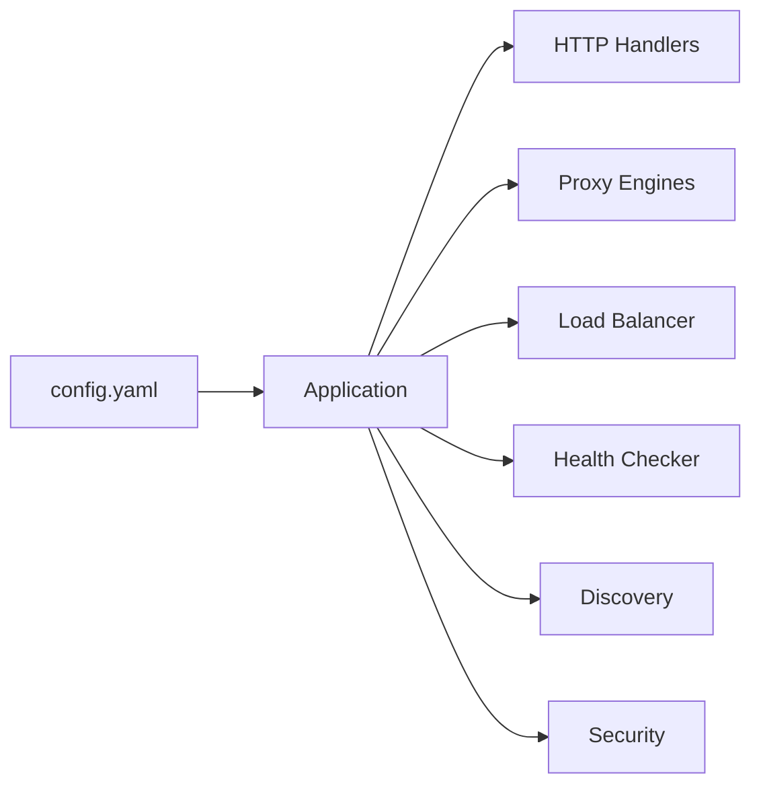

# Architecture Overview

Olla follows **Hexagonal Architecture** (Ports & Adapters) principles, ensuring clean separation of concerns, testability, and maintainability.

## High-Level Architecture



## Core Components

### Application Layer (`/internal/app/`)

The application layer handles HTTP requests and coordinates between components:

- **HTTP Handlers**: Process incoming requests and format responses
- **Request Router**: Routes requests to appropriate endpoints based on models and availability
- **Middleware**: Security, logging, and request validation

### Core Domain (`/internal/core/`)

Contains the business logic and domain models:

#### Domain Models (`/internal/core/domain/`)
- **Endpoint**: Represents an LLM service endpoint
- **LoadBalancer**: Manages endpoint selection strategies  
- **Model**: Represents available LLM models
- **Request/Response**: HTTP request/response abstractions

#### Ports (`/internal/core/ports/`)
Interface definitions that adapters must implement:

```go
type ProxyEngine interface {
    ProcessRequest(ctx context.Context, req *ProxyRequest) (*ProxyResponse, error)
    HealthCheck() error
    GetStats() EngineStats
}

type LoadBalancer interface {
    SelectEndpoint(ctx context.Context, model string) (*Endpoint, error)
    RegisterEndpoint(endpoint *Endpoint) error
    RemoveEndpoint(name string) error
}

type HealthChecker interface {
    CheckEndpoint(ctx context.Context, endpoint *Endpoint) error
    StartMonitoring(ctx context.Context) error
    GetStatus() map[string]HealthStatus
}
```

### Adapter Layer (`/internal/adapter/`)

Infrastructure implementations of the core ports:

#### Proxy Engines (`/internal/adapter/proxy/`)

**Sherpa Engine** - Simple and maintainable:
- Standard Go HTTP client
- Basic connection pooling
- Simple retry logic
- Lower resource usage
- Ideal for development and moderate loads

**Olla Engine** - High-performance:
- Custom connection pooling
- Object pooling for memory efficiency
- Circuit breakers
- Advanced retry strategies
- Lock-free statistics
- Optimised for high-throughput production

#### Load Balancers (`/internal/adapter/balancer/`)

- **Priority**: Select highest priority available endpoint
- **Round Robin**: Cycle through available endpoints
- **Least Connections**: Route to endpoint with fewest active connections

#### Health Checking (`/internal/adapter/health/`)

- Periodic health checks with configurable intervals
- Circuit breaker pattern for failing endpoints
- Automatic recovery detection
- Health status caching

#### Service Discovery (`/internal/adapter/discovery/`)

- **Static**: Configuration-based endpoint discovery
- **Dynamic**: Future support for service discovery systems
- Model discovery and registry updates

#### Security (`/internal/adapter/security/`)

- Rate limiting per IP and globally
- Request size validation
- Header validation
- Trusted proxy support

#### Statistics (`/internal/adapter/stats/`)

- Lock-free atomic counters
- Request/response metrics
- Latency tracking
- Memory efficient aggregation

## Request Flow



## Configuration Architecture

Configuration flows through the system using dependency injection:



## Concurrency Model

Olla uses Go's goroutine-based concurrency:

- **Request Handling**: Each request runs in its own goroutine
- **Health Checking**: Background goroutines monitor endpoint health
- **Statistics**: Lock-free atomic operations for high-performance metrics
- **Connection Pooling**: Shared connection pools across goroutines
- **Circuit Breakers**: Thread-safe state management

## Error Handling

Structured error handling throughout the system:

```go
type ProxyError struct {
    Code    int    `json:"code"`
    Message string `json:"message"`
    Cause   error  `json:"-"`
}
```

- **Graceful Degradation**: Continue serving from healthy endpoints
- **Circuit Breakers**: Automatically isolate failing endpoints
- **Retry Logic**: Configurable retry strategies with backoff
- **Error Propagation**: Structured error responses to clients

## Observability

Built-in observability features:

- **Request Tracing**: Unique request IDs and correlation
- **Metrics**: Performance and health metrics
- **Logging**: Structured JSON logging
- **Health Endpoints**: `/internal/health` and `/internal/status`
- **Response Headers**: Debugging information in HTTP headers

## Testing Architecture

Comprehensive testing strategy:

- **Unit Tests**: Test individual components in isolation
- **Integration Tests**: Full request flow testing
- **Benchmark Tests**: Performance testing of critical paths
- **Contract Tests**: Ensure adapter implementations meet port contracts

## Security Considerations

- **Rate Limiting**: Protect against abuse and DoS
- **Request Validation**: Size limits and content validation  
- **Header Sanitisation**: Clean and validate HTTP headers
- **Circuit Breakers**: Protect downstream services
- **Trusted Proxies**: Secure proxy header handling

This architecture provides a solid foundation that's both performant and maintainable, allowing Olla to scale from development environments to high-throughput production systems.