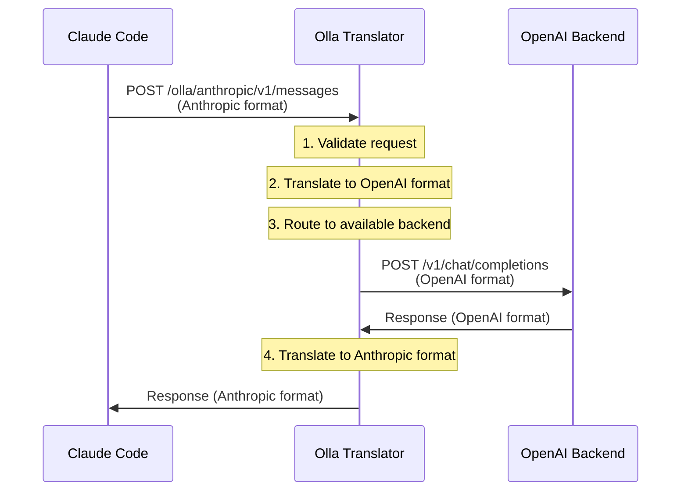

# API Translation

## What is API Translation?

API translation is a capability in Olla that converts requests and responses between different LLM API formats in real-time. This enables clients designed for one API format (e.g., Anthropic Messages API) to work seamlessly with backends that implement a different format (e.g., OpenAI Chat Completions API).

**Key Benefit**: Use any client with any backend, regardless of their native API formats.

### Why Translation is Needed

Different LLM providers use different API formats:

| Provider | API Format | Example Client |
|----------|------------|----------------|
| Anthropic | Messages API | Claude Code, Crush CLI |
| OpenAI | Chat Completions API | OpenAI libraries, most tools |
| Ollama | Native + OpenAI-compatible | Ollama CLI, OpenWebUI |
| vLLM | OpenAI-compatible | Standard OpenAI clients |

Without translation, you would need:

- Different proxy setups for different clients
- Client-specific backend configurations
- Separate infrastructure for each API format

With translation, Olla acts as a universal adapter:

- One proxy for all clients
- One configuration for all backends
- Seamless interoperability
- Minimal overhead and latency

---

## How Translation Works

### Request Flow

For an Anthropic Message (say from [Claude Code](https://www.claude.com/product/claude-code)), sent to Olla's Anthropic Endpoint:



### Translation Stages

#### Stage 1: Request Translation

**Input** (Anthropic Messages API):
```json
{
  "model": "llama4.0:latest",
  "max_tokens": 1024,
  "system": "You are a helpful assistant.",
  "messages": [
    {"role": "user", "content": "Hello!"}
  ],
  "temperature": 0.7
}
```

**Transformations**:

1. Extract `system` parameter
2. Convert to first message with `role: "system"`
3. Preserve other messages
4. Map parameter names directly (e.g., `max_tokens` → `max_tokens`)
5. Convert content blocks (if multi-modal)

**Output** (OpenAI Chat Completions):
```json
{
  "model": "llama4.0:latest",
  "max_tokens": 1024,
  "messages": [
    {"role": "system", "content": "You are a helpful assistant."},
    {"role": "user", "content": "Hello!"}
  ],
  "temperature": 0.7
}
```

#### Stage 2: Backend Processing

The backend (Ollama, LM Studio, vLLM, etc.) processes the request **without knowing** it originated from an Anthropic client. From the backend's perspective, it's a standard OpenAI request.

#### Stage 3: Response Translation

**Input** (OpenAI Chat Completions):
```json
{
  "id": "chatcmpl-abc123",
  "object": "chat.completion",
  "model": "llama4.0:latest",
  "choices": [{
    "message": {
      "role": "assistant",
      "content": "Hello! How can I help you today?"
    },
    "finish_reason": "stop"
  }],
  "usage": {
    "prompt_tokens": 15,
    "completion_tokens": 10,
    "total_tokens": 25
  }
}
```

**Transformations**:

1. Restructure to Anthropic format
2. Wrap content in content blocks
3. Map finish reason (`"stop"` → `"end_turn"`, `"tool_calls"` → `"tool_use"`, `"length"` → `"max_tokens"`)
4. Extract usage information (`prompt_tokens` → `input_tokens`, `completion_tokens` → `output_tokens`)
5. Generate Anthropic-compatible message ID (Base58-encoded with `msg_01` prefix)

**Output** (Anthropic Messages API):
```json
{
  "id": "msg_01ABC123XYZ",
  "type": "message",
  "role": "assistant",
  "content": [
    {
      "type": "text",
      "text": "Hello! How can I help you today?"
    }
  ],
  "model": "llama4.0:latest",
  "stop_reason": "end_turn",
  "usage": {
    "input_tokens": 15,
    "output_tokens": 10
  }
}
```

### Streaming Translation

Streaming responses require continuous translation of Server-Sent Events (SSE):

**OpenAI Streaming** (input from backend):
```
data: {"choices":[{"delta":{"content":"Hello"}}]}

data: {"choices":[{"delta":{"content":"!"}}]}

data: [DONE]
```

**Anthropic Streaming** (output to client):
```
event: message_start
data: {"type":"message_start","message":{"id":"msg_01ABC","role":"assistant","model":"llama4.0:latest"}}

event: content_block_start
data: {"type":"content_block_start","index":0,"content_block":{"type":"text","text":""}}

event: content_block_delta
data: {"type":"content_block_delta","index":0,"delta":{"type":"text_delta","text":"Hello"}}

event: content_block_delta
data: {"type":"content_block_delta","index":0,"delta":{"type":"text_delta","text":"!"}}

event: content_block_stop
data: {"type":"content_block_stop","index":0}

event: message_delta
data: {"type":"message_delta","delta":{"stop_reason":"end_turn"},"usage":{"output_tokens":10}}

event: message_stop
data: {"type":"message_stop"}
```

#### Streaming Implementation Details

The translator uses a stateful streaming processor that:

1. **Tracks state** - Maintains current content block, tool call buffers, and message metadata
2. **Buffers tool arguments** - OpenAI streams tool arguments as partial JSON strings, which are buffered and parsed at the end
3. **Sends events in order** - Ensures `message_start` is sent before any content blocks
4. **Handles context switching** - Properly closes content blocks when switching between text and tool use
5. **Synchronous processing** - Uses blocking scanner for safer error handling (async support is planned)

---

## Supported Translations

### Anthropic Messages → OpenAI Chat Completions

**Status**: ✅ Fully implemented

**Supported Features**:

| Feature | Anthropic Format | OpenAI Format | Translation Status |
|---------|------------------|---------------|-------------------|
| Basic messages | `messages` array | `messages` array | ✅ Full |
| System prompt | `system` parameter | First system message | ✅ Full |
| Content blocks | `content` array | String or array | ✅ Full |
| Streaming | SSE events | SSE chunks | ✅ Full (synchronous) |
| Tool use | `tools` array | `functions` array | ✅ Full |
| Tool choice | `tool_choice` (`auto`/`any`/`tool`) | `tool_choice` (`auto`/`required`/object) | ✅ Full with semantic mapping |
| Vision | Image content blocks | Multi-part content | ⚠️ Partial (backend dependent) |
| Stop sequences | `stop_sequences` | `stop` | ✅ Direct |
| Temperature | `temperature` | `temperature` | ✅ Direct |
| Top P | `top_p` | `top_p` | ✅ Direct |
| Top K | `top_k` | N/A | ⚠️ Passed through if supported |
| Max tokens | `max_tokens` | `max_tokens` | ✅ Direct |

#### Tool Choice Mapping

The translator performs semantic mapping for tool choice parameters:

| Anthropic | OpenAI | Behaviour |
|-----------|--------|-----------|
| `"auto"` | `"auto"` | Let model decide whether to use tools |
| `"any"` | `"required"` | Force model to use a tool (any tool) |
| `"none"` | `"none"` | Disable tool use |
| `{"type":"tool","name":"X"}` | `{"type":"function","function":{"name":"X"}}` | Force specific tool |

---

## Architecture

### Translation Layer Position

```
┌─────────────────────────────────────────────────────────────┐
│                        Olla Proxy                           │
│                                                             │
│  ┌──────────────┐    ┌──────────────┐    ┌──────────────┐ │
│  │   Native     │    │  Translator  │    │   Backend    │ │
│  │  Endpoints   │    │    Layer     │    │   Routing    │ │
│  └──────────────┘    └──────────────┘    └──────────────┘ │
│         │                   │                    │         │
│         ▼                   ▼                    ▼         │
│  /olla/openai/*    /olla/anthropic/*    Load Balancer    │
│  (pass-through)      (translate)        Health Checks     │
│                                          Connection Pool   │
└─────────────────────────────────────────────────────────────┘
```

**Key Points**:

- Translation is **optional** and **transparent**
- Native endpoints bypass translation entirely
- Translated endpoints use the same backend infrastructure
- No impact on native endpoint performance

### Where Translation Happens

Translation occurs in the **adapter layer** of Olla:

```
internal/
├── adapter/
│   ├── translator/
│   │   └── anthropic/
│   │       ├── request.go          # Request translation
│   │       ├── response.go         # Response translation
│   │       ├── streaming.go        # SSE translation
│   │       ├── tools.go            # Tool/function translation
│   │       └── translator.go       # Main translator
│   └── proxy/
│       ├── sherpa/                 # Uses translator
│       └── olla/                   # Uses translator
```

**Process**:

1. Request arrives at `/olla/anthropic/v1/messages`
2. Handler invokes Anthropic translator
3. Translator converts request to OpenAI format
4. Proxy routes to backend (standard Olla routing)
5. Backend responds in OpenAI format
6. Translator converts response to Anthropic format
7. Response returned to client

### Memory Optimisation

The translator uses buffer pooling to minimise memory allocations:

- **Buffer pool**: 4KB initial capacity for most chat completions
- **Object reuse**: Buffers are returned to pool after use
- **GC pressure reduction**: Reduces garbage collection overhead during high-throughput operations

---

## Benefits

### 1. Client Flexibility

Use any client regardless of its API format:

- Claude Code (Anthropic API only) with Ollama
- OpenAI libraries with Anthropic-formatted backends
- Mix and match clients and backends freely

### 2. Backend Flexibility

Keep existing backend infrastructure:

- No backend reconfiguration needed
- No API format changes required
- Existing OpenAI-compatible backends work as-is

### 3. Unified Infrastructure

One proxy for everything:

- Single endpoint configuration
- One load balancer for all clients
- Unified monitoring and metrics
- Consistent health checking

### 4. Cost Optimisation

Use local models with cloud-designed clients:

- No cloud API costs
- Full local model support
- Automatic failover to cloud if needed (via LiteLLM)

### 5. Future-Proof

Easy to add new translations:

- Modular translator design
- Add new API formats without changing core proxy
- Support emerging LLM API standards

---

## Limitations

### Translation Overhead

**Performance Impact** (estimated from implementation):

- Request translation: 0.5-2ms per request
- Response translation: 1-5ms per request
- Streaming: ~0.1-0.5ms per chunk

**Memory Usage**:

- Minimal for basic text (~1-5KB per request)
- Proportional to content size for vision models
- Buffer pool reduces allocation overhead

**Recommendation**: Use native endpoints when translation isn't needed for maximum performance.

### Feature Parity

Not all features translate perfectly:

**Anthropic → OpenAI Limitations**:

- Extended thinking: Not supported (Anthropic-specific feature)
- Prompt caching: Not supported (Anthropic-specific feature)
- Some advanced parameters may not have OpenAI equivalents

**Backend Limitations**:

- Tool use: Requires function-calling capable model
- Vision: Requires multi-modal model (implementation supports base64 images)
- Token counting: Estimated, not exact (depends on backend tokeniser)
- Parallel queries (especially for agent work in Claude Code) is not supported

**Recommendation**: For tools like Claude Code, use [Claude Code Router](https://github.com/musistudio/claude-code-router).

### Streaming Format

Streaming translation requires:

- Full SSE event restructuring
- Potential for slight buffering (tool arguments are buffered until complete)
- Client must support SSE with named events
- Currently synchronous (async support planned for agentic workflows)

**Recommendation**: For tools like Claude Code, use [Claude Code Router](https://github.com/musistudio/claude-code-router).

---

## Configuration

### Enable Translation

```yaml
translators:
  anthropic:
    enabled: true                   # Enable Anthropic translator
    max_message_size: 10485760     # Max request size (10MB)
```

### Disable Translation

To use native endpoints only:

```yaml
translators:
  anthropic:
    enabled: false
```

Anthropic endpoints will return 404 when disabled.

### Performance Tuning

For high-throughput translation:

```yaml
proxy:
  engine: "olla"                    # Use high-performance engine
  profile: "streaming"              # Low-latency streaming

translators:
  anthropic:
    enabled: true
    max_message_size: 52428800     # Increase for large requests (50MB)
```

---

## Use Cases

### Use Case 1: Claude Code with Local Models

**Scenario**: Developer wants to use Claude Code but doesn't want cloud API costs.

**Solution**: Olla translates Claude Code's Anthropic requests to work with local Ollama.

```yaml
translators:
  anthropic:
    enabled: true

discovery:
  static:
    endpoints:
      - url: "http://localhost:11434"
        type: "ollama"
```

**Command**:
```bash
export ANTHROPIC_BASE_URL="http://localhost:40114/olla/anthropic"
claude
```

See detailed [Claude Code Integration](../integrations/frontend/claude-code.md) guide.

### Use Case 2: Multi-Client Support

**Scenario**: Team uses mix of OpenAI and Anthropic clients with same backend.

**Solution**: Olla provides both `/olla/openai/*` and `/olla/anthropic/*` endpoints.

**Configuration**: Same as above, supports both clients simultaneously.

### Use Case 3: Cloud Fallback

**Scenario**: Use local models when available, fall back to Anthropic cloud API.

**Solution**: Combine translation with LiteLLM backend.

```yaml
translators:
  anthropic:
    enabled: true

discovery:
  static:
    endpoints:
      - url: "http://localhost:11434"
        type: "ollama"
        priority: 100                # Prefer local

      - url: "http://localhost:4000"
        type: "litellm"              # LiteLLM gateway to Anthropic
        priority: 50                 # Fallback
```

### Use Case 4: Testing & Development

**Scenario**: Test Anthropic API integration before deploying to production.

**Solution**: Use Olla translation with local models for free testing.

**Benefit**: Develop against Anthropic API without API costs.

---

## Performance Considerations

### When to Use Translation

**Good Use Cases**:

- Client requires specific API format
- Testing API integrations locally
- Cost optimisation (local instead of cloud)
- Multi-client support needed

**Avoid When**:

- Both client and backend use same format (use native endpoints)
- Extreme latency requirements (<10ms total)
- High throughput (>10,000 req/s per instance)

### Optimisation Tips

1. **Use High-Performance Engine**:
   ```yaml
   proxy:
     engine: "olla"  # Not "sherpa"
   ```

2. **Enable Streaming Profile**:
   ```yaml
   proxy:
     profile: "streaming"
   ```

3. **Connection Pooling**:
   ```yaml
   proxy:
     max_connections_per_endpoint: 100
   ```

4. **Local Backends**:
   - Prefer Ollama/LM Studio on same machine
   - Avoid network latency

5. **Appropriate Timeouts**:
   ```yaml
   proxy:
     response_timeout: 300s      # 5 minutes for long generations
     read_timeout: 60s
   ```

6. **Request Size Limits**:
   ```yaml
   translators:
     anthropic:
       max_message_size: 10485760  # 10MB default, adjust as needed
   ```

---

## Troubleshooting

### Translation Errors

**Issue**: Requests fail with translation errors

**Possible Causes**:

- Invalid request format
- Unsupported content blocks
- Malformed JSON in request

**Solutions**:

1. Check request format matches Anthropic Messages API schema
2. Enable debug logging to see translation details:
   ```yaml
   logging:
     level: debug
   ```
3. Verify `max_message_size` isn't too restrictive
4. Check logs for specific validation errors

### Streaming Issues

**Issue**: Streaming responses are incomplete or malformed

**Possible Causes**:

- Backend doesn't support streaming
- Network issues interrupting stream
- Client doesn't support named SSE events

**Solutions**:

1. Verify backend supports streaming:
   ```bash
   curl -X POST http://localhost:11434/v1/chat/completions \
     -H "Content-Type: application/json" \
     -d '{"model":"llama4.0:latest","messages":[{"role":"user","content":"test"}],"stream":true}'
   ```
2. Check client supports SSE with event names
3. Monitor logs for stream processing errors

### Tool Use Not Working

**Issue**: Tool/function calls not translating correctly

**Possible Causes**:

- Backend model doesn't support function calling
- Tool schema incompatible with backend
- Tool choice mapping issue

**Solutions**:

1. Verify model supports tools:
   - Llama 3.1+ models support function calling
   - Check model capabilities in documentation
2. Review tool definitions in logs
3. Test with simple tool first

---

## Next Steps

- **[Anthropic API Reference](../api-reference/anthropic.md)** - Complete API documentation
- **[Anthropic Translation Setup](../integrations/api-translation/anthropic.md)** - Configuration guide
- **[Claude Code Integration](../integrations/frontend/claude-code.md)** - Claude Code setup
- **[Load Balancing](load-balancing.md)** - Distribute translated requests
- **[Model Routing](model-routing.md)** - Route to appropriate backends

---

## Related Concepts

- [Proxy Engines](proxy-engines.md) - Choose the right engine for performance
- [Health Checking](health-checking.md) - Ensure backend availability
- [Model Unification](model-unification.md) - Unified model catalogue
