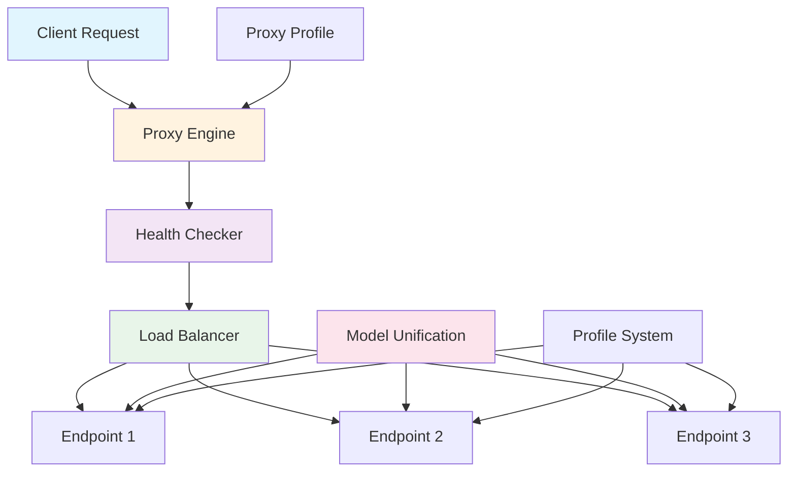

# Concepts Overview

Olla is built on several core concepts that work together to provide intelligent LLM request routing and management. This section introduces the key components and how they interact.

## Core Components

### [Proxy Engines](proxy-engines.md)
The heart of Olla - two distinct proxy implementations optimised for different scenarios:

- **Sherpa**: Simple, maintainable proxy with shared HTTP transport
- **Olla**: High-performance proxy with per-endpoint connection pools

Understanding the trade-offs between these engines helps you choose the right one for your workload.

### [Load Balancing](load-balancing.md)
Intelligent request distribution across multiple endpoints:

- **Priority-based**: Routes to preferred endpoints first
- **Round-robin**: Even distribution across endpoints
- **Least-connections**: Routes to least busy endpoints

Load balancing ensures optimal resource utilisation and failover capability.

### [Health Checking](health-checking.md)
Automatic endpoint monitoring and failure detection:

- Periodic health checks with configurable intervals
- Automatic endpoint recovery with exponential backoff
- Circuit breaker pattern to prevent cascade failures

Health checking maintains service reliability by routing around failures.

### [Model Unification](model-unification.md)
Standardised model discovery and management:

- Automatic model discovery from connected endpoints
- Per-provider model format unification
- Consistent model naming across different backends

Model unification simplifies working with heterogeneous LLM infrastructure.

### [Model Routing](model-routing.md)
Intelligent routing strategies for model availability:

- **Strict**: Only route to endpoints with the model
- **Optimistic**: Route to endpoints with model, with configurable fallback
- **Discovery**: Refresh model catalog before routing

Model routing ensures requests reach appropriate endpoints based on model availability.

### [Proxy Profiles](proxy-profiles.md)
Response handling strategies for different use cases:

- **Auto**: Intelligent detection based on content
- **Streaming**: Immediate token streaming for chat
- **Standard**: Buffered responses for APIs

Profiles optimise response handling for specific workload patterns.

### [Profile System](profile-system.md)
Provider-specific configuration templates:

- Pre-configured profiles for Ollama, LM Studio, vLLM, SGLang, Lemonade SDK, LiteLLM, OpenAI
- Custom header mappings and endpoint patterns
- Model format converters for each provider

The profile system ensures compatibility with various LLM providers.

### [Provider Metrics](provider-metrics.md)
Real-time performance metrics extraction:

- Automatic extraction from provider responses
- Token usage and generation speed tracking
- Processing latency measurements
- Best-effort extraction with zero performance impact

Provider metrics give insights into model performance and resource usage.

## How Components Work Together

1. **Requests arrive** at the proxy engine (Sherpa or Olla)
2. **Health checking** ensures only healthy endpoints are used
3. **Load balancer** selects the optimal endpoint
4. **Profile system** applies provider-specific configurations
5. **Model unification** ensures consistent model access
6. **Proxy profile** determines response handling strategy

## Choosing Components

### For Development

- **Engine**: Sherpa (simpler, easier to debug)
- **Balancer**: Priority (predictable routing)
- **Profile**: Auto (handles most cases)

### For Production

- **Engine**: Olla (optimised for performance)
- **Balancer**: Priority or Least-connections
- **Profile**: Auto or Streaming (for chat applications)

### For High Availability

- Multiple endpoints with health checking
- Circuit breakers to prevent cascade failures
- Appropriate timeout configurations

## Configuration Philosophy

Olla follows a **convention over configuration** approach:

- Sensible defaults that work for most cases
- Progressive disclosure of advanced options
- Provider-specific profiles for quick setup
- Fine-grained control when needed

## Next Steps

- Start with [Proxy Engines](proxy-engines.md) to understand request handling
- Configure [Load Balancing](load-balancing.md) for your infrastructure
- Set up [Health Checking](health-checking.md) for reliability
- Choose appropriate [Proxy Profiles](proxy-profiles.md) for your use case