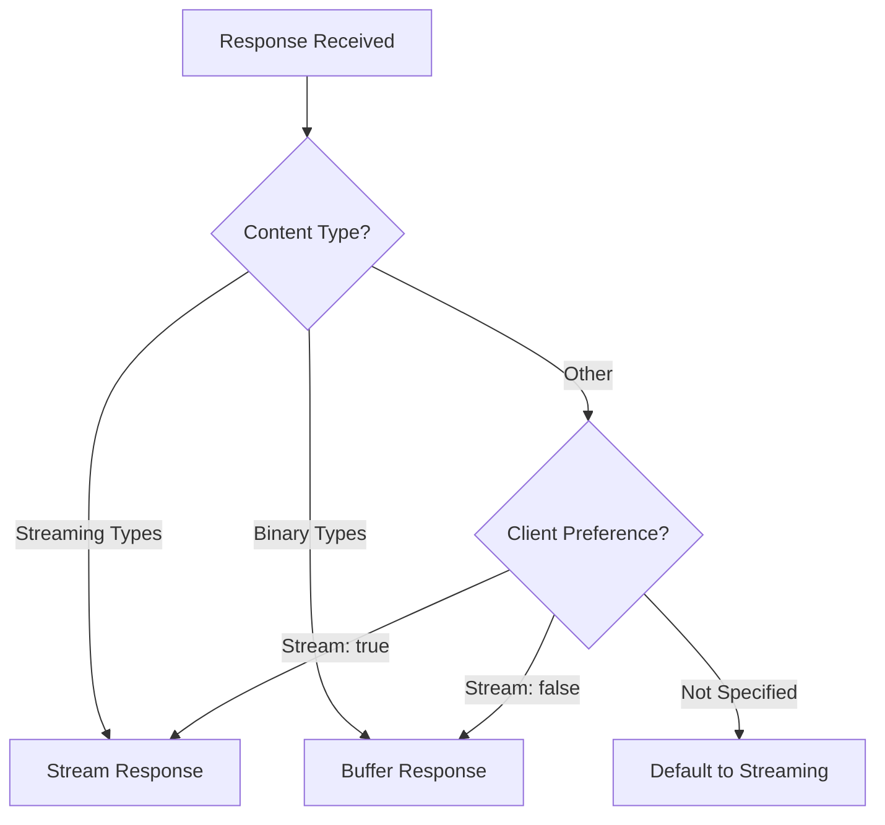

# Proxy Profiles

Proxy profiles control how Olla handles HTTP streaming and response buffering. 

> :memo: **Default Configuration**
> ```yaml
> proxy:
>  profile: "auto"  # auto, streaming, or standard
> ```
> **Supported**:
> 
> - `auto` _(default)_
> - `streaming`
> - `standard`
> 
> **Environment Variable**: Unsupported

## Available Profiles

Olla provides three proxy profiles:

| Profile | Description | Use Case |
|---------|-------------|----------|
| **auto** | Intelligent detection based on content type | Recommended default |
| **streaming** | Forces immediate token streaming | Interactive chat applications |
| **standard** | Buffers complete response before sending | REST APIs, file downloads |

!!! note "Use `auto` for most workloads"
    For most scenarios, using the `auto` setting should provide the best performance and memory usage for all workloads.

## Configuration

Set the proxy profile in your configuration:

```yaml
proxy:
  profile: "auto"  # auto, streaming, or standard
```

!!! note "Environment Variable Not Supported"
    The proxy profile can only be configured via the YAML configuration file. Environment variable override is not currently implemented.

## Profile Behaviour

### `auto` Profile (Default)

The `auto` profile intelligently determines whether to stream or buffer based on:

1. **Content Type Detection**
2. **Client Preferences** (stream parameter in request)
3. **Response Characteristics**

#### Detection Logic



#### Streaming Content Types

Auto profile streams these content types immediately:

- `text/event-stream` - Server-sent events
- `application/x-ndjson` - Newline-delimited JSON
- `application/stream+json` - Streaming JSON
- `application/json-seq` - JSON sequences
- `text/plain; charset=utf-8` - Plain text (common for LLM streaming)

#### Buffered Content Types

Auto profile buffers these content types:

- Images: `image/*`
- Video: `video/*`
- Audio: `audio/*`
- Documents: `application/pdf`, `application/msword`
- Archives: `application/zip`, `application/gzip`
- Binary: `application/octet-stream`

### `streaming` Profile

Forces immediate streaming for all responses.

#### Characteristics

- **Zero Buffering**: Tokens stream as they arrive
- **Low Latency**: First token appears immediately
- **Memory Efficient**: No response buffering
- **Real-time**: Users see generation progress

#### Best For

- Chat interfaces
- Interactive applications
- Long-form text generation
- Real-time completions

#### Configuration Example

```yaml
proxy:
  profile: "streaming"
  stream_buffer_size: 4096  # 4KB for faster first token
```

!!! tip "Stream Buffer Size"
    The `stream_buffer_size` setting controls chunk size during streaming. Smaller buffers (2-4KB) provide lower latency for first token, while larger buffers (16-64KB) improve throughput. See [Stream Buffer Size](proxy-engines.md#stream-buffer-size) in the Proxy Engines documentation for detailed tuning guidance.

#### Implementation Details

When streaming is enabled:

1. Response headers sent immediately
2. Each chunk flushed to client as received
3. No content accumulation in memory
4. HTTP/1.1 chunked transfer encoding used

### `standard` Profile

Buffers the complete response before sending.

#### Characteristics

- **Full Buffering**: Complete response collected
- **Atomic Delivery**: All-or-nothing response
- **Content Integrity**: Ensures complete files
- **Traditional HTTP**: Standard request-response pattern

#### Best For

- REST API calls
- File downloads
- Binary content
- Non-interactive requests
- Embedding generation

#### Configuration Example

```yaml
proxy:
  profile: "standard"
  response_timeout: 300s  # Allow time for full response
```

#### Implementation Details

When buffering is enabled:

1. Complete response accumulated in memory
2. Content-Length header calculated
3. Response sent in single transmission
4. Better for caching and CDNs

## Use Case Examples

### Chat Application

For interactive chat with streaming responses:

```yaml
proxy:
  engine: "sherpa"
  profile: "streaming"
  stream_buffer_size: 4096  # Smaller chunks for faster updates
  
server:
  write_timeout: 0s  # No timeout for streaming
```

### API Gateway

For REST API serving embeddings and completions:

```yaml
proxy:
  engine: "olla"
  profile: "standard"
  response_timeout: 60s
  
server:
  write_timeout: 30s  # Reasonable timeout for buffered responses
```

### Mixed Workload

For handling both chat and API requests:

```yaml
proxy:
  engine: "olla"
  profile: "auto"  # Intelligent detection
  stream_buffer_size: 8192
  
server:
  write_timeout: 0s  # Support streaming when detected
```

## Performance Implications

### Memory Usage

| Profile | Memory Usage | Description |
|---------|--------------|-------------|
| **streaming** | Low | Only buffer size per request |
| **auto** | Variable | Depends on content type |
| **standard** | High | Full response in memory |

### Latency

| Profile | First Byte | Last Byte | Use Case |
|---------|------------|-----------|----------|
| **streaming** | Fast | Normal | Interactive |
| **auto** | Variable | Normal | General |
| **standard** | Slow | Fast | Batch/API |

### Network Efficiency

| Profile | Network Usage | TCP Behaviour |
|---------|---------------|---------------|
| **streaming** | Multiple small packets | Frequent flushes |
| **auto** | Optimised per content | Adaptive |
| **standard** | Single large transfer | Efficient |

## Client Compatibility

### Streaming Profile Clients

Clients that work well with streaming:

- **OpenAI SDK**: Native streaming support
- **LangChain**: Stream callbacks
- **curl**: With `--no-buffer` flag
- **Browser EventSource**: Server-sent events
- **WebSockets**: Real-time communication

Example with OpenAI SDK:

```python
from openai import OpenAI

client = OpenAI(base_url="http://localhost:40114/olla/ollama/v1")

stream = client.chat.completions.create(
    model="llama3.2",
    messages=[{"role": "user", "content": "Tell a story"}],
    stream=True  # Enable streaming
)

for chunk in stream:
    print(chunk.choices[0].delta.content, end="")
```

### Standard Profile Clients

Clients that require buffered responses:

- **REST clients**: Standard HTTP libraries
- **Batch processors**: Complete response needed
- **File downloaders**: Binary content
- **Legacy systems**: No streaming support

Example with requests:

```python
import requests

response = requests.post(
    "http://localhost:40114/olla/ollama/v1/embeddings",
    json={
        "model": "nomic-embed-text",
        "input": "Hello world"
    }
)
embeddings = response.json()
```

## Debugging

### Check Active Profile

View the current profile in logs:

```bash
docker logs olla | grep "proxy profile"
```

### Test Streaming Behaviour

```bash
# Test streaming (should see gradual output)
curl -N http://localhost:40114/olla/ollama/api/generate \
  -d '{"model":"llama3.2","prompt":"Count to 10 slowly","stream":true}'

# Test buffered (complete response at once)
curl http://localhost:40114/olla/ollama/api/generate \
  -d '{"model":"llama3.2","prompt":"Say hello","stream":false}'
```

### Monitor Response Headers

```bash
curl -I http://localhost:40114/olla/ollama/api/tags

# Streaming response shows:
# Transfer-Encoding: chunked

# Buffered response shows:
# Content-Length: 12345
```

## Troubleshooting

### Issue: Streaming Not Working

**Symptoms**: Responses arrive all at once despite streaming profile

**Solutions**:

1. Check write timeout is 0:
   ```yaml
   server:
     write_timeout: 0s
   ```

2. Verify client supports streaming:
   ```bash
   curl -N  # Use -N flag for no buffering
   ```

### Issue: Binary Files Corrupted

**Symptoms**: Downloaded files are corrupted when using streaming profile

**Solutions**:

1. Use auto profile for mixed content:
   ```yaml
   proxy:
     profile: "auto"
   ```

2. Or use standard profile for file serving:
   ```yaml
   proxy:
     profile: "standard"
   ```

### Issue: High Memory Usage

**Symptoms**: Memory spikes with standard profile

**Solutions**:

1. Use streaming for large responses:
   ```yaml
   proxy:
     profile: "streaming"
   ```

2. Reduce buffer size:
   ```yaml
   proxy:
     stream_buffer_size: 4096  # 4KB instead of 8KB
   ```

3. Set response size limits:
   ```yaml
   server:
     request_limits:
       max_body_size: 10485760  # 10MB limit
   ```

## Best Practices

### 1. Use Auto for General Purpose

The auto profile handles most scenarios correctly:

```yaml
proxy:
  profile: "auto"
```

### 2. Force Streaming for Chat UIs

Interactive applications benefit from streaming:

```yaml
proxy:
  profile: "streaming"
  stream_buffer_size: 4096  # Smaller chunks for responsiveness
```

### 3. Use Standard for APIs

REST APIs and file serving need complete responses:

```yaml
proxy:
  profile: "standard"
  response_timeout: 120s  # Allow time for processing
```

### 4. Monitor Performance

Track metrics for different profiles:

```bash
# Check response times
curl http://localhost:40114/internal/status

# Monitor memory usage
docker stats olla
```

## Advanced Configuration

### Per-Endpoint Profiles

While Olla doesn't support per-endpoint profiles directly, you can run multiple instances with different configurations:

```yaml
# Instance 1: Streaming for chat
services:
  olla-chat:
    image: ghcr.io/thushan/olla:latest
    volumes:
      - ./config-streaming.yaml:/config/config.yaml
    environment:
      - OLLA_SERVER_PORT=40115

# Instance 2: Standard for API
  olla-api:
    image: ghcr.io/thushan/olla:latest
    volumes:
      - ./config-standard.yaml:/config/config.yaml
    environment:
      - OLLA_SERVER_PORT=40116
```

Each config file would specify the desired proxy profile.

### Custom Buffer Sizes

Optimise buffer size for your use case:

```yaml
proxy:
  stream_buffer_size: 16384  # 16KB for high-throughput
  # OR
  stream_buffer_size: 2048   # 2KB for low-latency
```

Considerations:

- Larger buffers: Fewer system calls, better throughput
- Smaller buffers: Lower latency, more responsive

## Next Steps

- [Proxy Engines](proxy-engines.md) - Compare Sherpa and Olla engines
- [Configuration Reference](../configuration/reference.md) - Complete proxy configuration
- [Performance Tuning](../configuration/practices/performance.md) - Optimisation guide