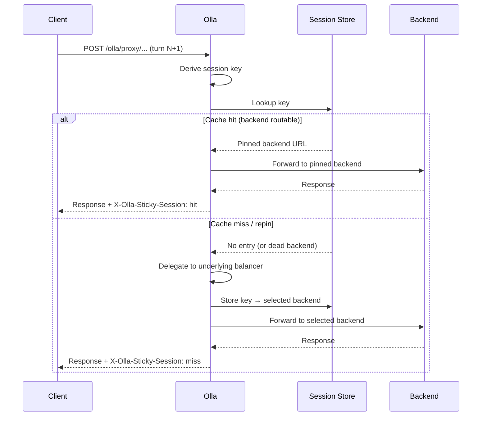
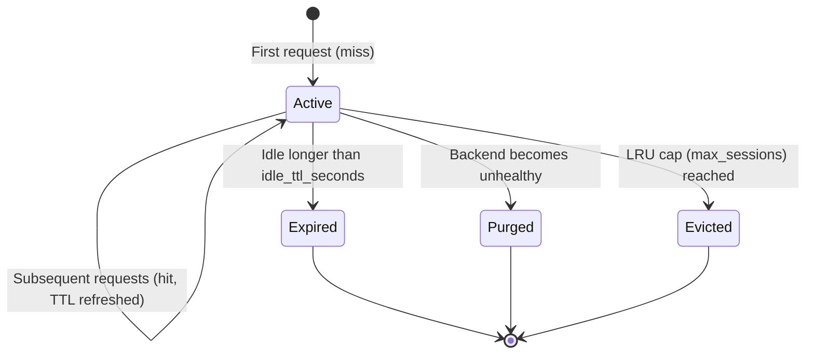

# Sticky Sessions

> :memo: **Default Configuration**
> ```yaml
> proxy:
>   sticky_sessions:
>     enabled: false
> ```
> Sticky sessions are **opt-in**. Set `enabled: true` under `proxy.sticky_sessions` to activate KV-cache affinity routing.
>
> **Environment Variable**: `OLLA_PROXY_STICKY_SESSIONS_ENABLED`

Sticky sessions route repeat turns in a multi-turn conversation to the same backend endpoint, maximising KV-cache reuse across turns. The feature wraps the configured load balancer as a decorator. The underlying strategy (priority, round-robin, least-connections) is unchanged for new sessions and fallback cases.

## Why sticky sessions

Modern LLM backends maintain a KV-cache for the token sequence they have already processed. When the next turn of a conversation lands on the **same** backend, the backend can skip re-ingesting the full context and jump straight to generating new tokens. For long conversations this produces a substantial reduction in both time-to-first-token and compute cost; the benefit scales with context length.

Without affinity, a load balancer may distribute turn N and turn N+1 to different backends. The receiving backend for turn N+1 has a cold cache and must process the entire prompt from scratch. For workloads with short prompts or single-turn completions this overhead is negligible; for chat-style applications with growing context it compounds with every turn.

## How it works

On each request, Olla computes a **session key** from one of the configured key sources (see [Key sources](#key-sources) below). The key is looked up in an in-memory LRU/TTL store:

- **Hit**: the pinned backend is still routable; the request is sent there and the TTL is refreshed.
- **Miss**: no entry exists; the request is forwarded to the underlying balancer, and the selected backend is stored.
- **Repin**: an entry exists but the pinned backend is no longer routable; the underlying balancer selects a new backend and the entry is overwritten.
- **Disabled**: no key source produced a usable key (e.g. no `X-Olla-Session-ID` header and no other sources configured); the request is passed through to the underlying balancer without recording anything.



## Key sources

The `key_sources` list is evaluated in order; the first source that produces a non-empty value wins. All keys are scoped to the model name so the same client talking to different models maintains independent session state.

| Source | How the key is derived | When to prefer it | Caveats |
|---|---|---|---|
| `session_header` | FNV-64a hash of the `X-Olla-Session-ID` request header | Explicit client opt-in; most reliable | Client must send the header consistently |
| `prefix_hash` | FNV-64a hash of the first `prefix_hash_bytes` bytes of the `messages` JSON field | No client changes needed; best cache locality | Two conversations with identical opening messages share a session |
| `auth_header` | FNV-64a hash of the `Authorization` header value | Per-user affinity without client changes | Breaks if the token rotates mid-conversation; unreliable with shared tokens |
| `ip` | Client IP address (extracted via `net.SplitHostPort`) | Simple deployments with no NAT | Unreliable behind NAT, load balancers, or Docker networking |

All header and token values are hashed before storage; plaintext secrets are never written to the session store.

The default configuration enables `session_header`, `prefix_hash`, and `auth_header` (in that order) and comments out `ip` because it is unreliable behind typical container networking. Adjust the list to suit your deployment.

## Session lifecycle and eviction

Sessions do not live forever. Three mechanisms remove them:

**Sliding TTL**: every cache hit refreshes the expiry timer. A session that goes idle for longer than `idle_ttl_seconds` is expired automatically. Active conversations are never interrupted mid-session.

**LRU eviction**: when the store reaches `max_sessions`, the least-recently-used entry is evicted to make room. Under normal load this should never occur; it acts as a safety cap to bound memory usage.

**Health-based purge**: when the health checker transitions a backend to an unhealthy state, Olla immediately calls `PurgeDeadEndpoints` with the current routable set. Any session entry pointing to the now-dead backend is deleted without waiting for TTL. The next request for that session falls through to the underlying balancer and receives a `repin`.

!!! note "Busy endpoints are not purged"
    A backend in the **Busy** state is still considered routable (`IsRoutable() == true`). Sticky sessions are preserved through Busy transitions; the backend is overloaded but still serving. Only transitions to Unhealthy, Offline, or Unknown trigger a purge.



## Response headers

Olla writes three response headers so clients and operators can observe affinity decisions:

| Header | Values | Meaning |
|---|---|---|
| `X-Olla-Sticky-Session` | `hit` / `miss` / `repin` / `disabled` | Outcome of the affinity lookup for this request |
| `X-Olla-Sticky-Key-Source` | `session_header` / `prefix_hash` / `auth_header` / `ip` / `none` | Which key source was used (absent when outcome is `disabled`) |
| `X-Olla-Session-ID` | _(echoed from request)_ | Present in the response only when the client sent `X-Olla-Session-ID`; lets stateless clients confirm the header was received |

Example: first request (miss), client provides explicit session ID:

```bash
curl -i -X POST http://localhost:40114/olla/proxy/api/chat \
  -H "X-Olla-Session-ID: conv-abc123" \
  -H "Content-Type: application/json" \
  -d '{"model":"llama3.2","messages":[{"role":"user","content":"Hello"}]}'
```

```http
HTTP/1.1 200 OK
X-Olla-Endpoint: gpu-server-1
X-Olla-Sticky-Session: miss
X-Olla-Sticky-Key-Source: session_header
X-Olla-Session-ID: conv-abc123
```

Subsequent request (hit):

```http
HTTP/1.1 200 OK
X-Olla-Endpoint: gpu-server-1
X-Olla-Sticky-Session: hit
X-Olla-Sticky-Key-Source: session_header
X-Olla-Session-ID: conv-abc123
```

## Configuration

All fields live under `proxy.sticky_sessions`:

```yaml
proxy:
  sticky_sessions:
    enabled: false              # opt-in: set true to activate affinity routing

    idle_ttl_seconds: 600       # sliding TTL in seconds; 0 = sessions never expire by TTL
                                # (not recommended, sessions accumulate until LRU eviction)

    max_sessions: 10000         # LRU capacity; oldest entries are evicted when full

    key_sources:                # ordered cascade, first match wins
      - "session_header"        # X-Olla-Session-ID header (explicit client opt-in)
      - "prefix_hash"           # hash of first N bytes of messages JSON
      - "auth_header"           # hash of Authorization header (per-user affinity)
      # - "ip"                  # client IP, opt-in; unreliable behind NAT/Docker

    prefix_hash_bytes: 512      # bytes of the messages field to hash for prefix_hash source;
                                # larger values reduce false collisions at a small CPU cost
```

The only env var exposed for this feature is `OLLA_PROXY_STICKY_SESSIONS_ENABLED` (boolean). The remaining fields are configuration-file only.

## Observability

### Stats endpoint

```bash
curl http://localhost:40114/internal/stats/sticky
```

When sticky sessions are **enabled**:

```json
{
  "enabled": true,
  "active_sessions": 142,
  "insertions": 1500,
  "hits": 9231,
  "misses": 1500,
  "evictions": 0,
  "max_sessions": 10000,
  "idle_ttl_seconds": 600
}
```

When sticky sessions are **disabled** (stable shape for scripting):

```json
{
  "enabled": false
}
```

Scripts should branch on the `enabled` field; the endpoint always returns `200 OK` regardless of whether the feature is active.

## When NOT to use sticky sessions

Sticky sessions trade load distribution for cache locality. They are not always the right choice:

- **Stateless or single-turn workloads**: embeddings, one-shot completions, and batch jobs gain nothing from affinity; use the plain load balancer.
- **Model-routing-dominated traffic**: if requests are already hard-routed to specific endpoints by model routing, the sticky wrapper adds overhead with no benefit.
- **Very small deployments**: two endpoints with priority load balancing already behave predictably; adding stickiness is unnecessary complexity.
- **Homogeneous short-prompt workloads**: when prompts are short and vary widely, KV-cache hit rates on the backend are already low; affinity provides little gain and reduces load distribution.
- **Deployments with aggressive autoscaling**: if backends are added and removed frequently, sessions will repin often and the affinity benefit is diluted.

## Developer notes

**Decorator pattern**: `StickySessionWrapper` in `internal/adapter/balancer/sticky.go` wraps any `domain.EndpointSelector` implementation. No factory or registry changes are needed to add a new inner balancer; the wrapper is applied in `ProxyServiceWrapper.applyStickySessions()` inside `internal/app/services/proxy.go`.

**Hashing**: FNV-64a (`hash/fnv`) is used for all key derivation. It is non-cryptographic and intended only as a compact routing hint; collisions are acceptable (two different sessions occasionally land on the same backend). Do not use these keys as security tokens.

**Import cycle avoidance**: `StickyOutcome` is defined in `internal/core/domain/routing.go` rather than in `internal/adapter/balancer/sticky.go`. This allows `internal/adapter/proxy/core` (the proxy engine shared layer) to read the outcome and write response headers without importing the balancer package, which would create a cycle.

**Purge wiring order**: `applyStickySessions()` assigns `s.stickyWrapper` and then immediately calls `s.discoverySvc.SetPurgeDeadEndpointsFn(s.PurgeDeadEndpoints)`. This ensures the write of `stickyWrapper` happens-before the health-checker goroutine can observe it via the purge callback. The registration happens inside `ProxyServiceWrapper.Start()`, not at construction time, to respect service startup ordering.

**Session store**: backed by `github.com/jellydator/ttlcache/v3` with `WithCapacity` (LRU) and `WithTTL` (sliding expiry). The `ttlcache.Get` call inside `Select` refreshes the TTL automatically on every hit.

Relevant source files: `internal/adapter/balancer/sticky.go`, `internal/core/domain/routing.go`, `internal/app/services/proxy.go`, `internal/app/services/discovery.go`, `internal/app/handlers/handler_proxy.go`, `internal/app/handlers/handler_stats_sticky.go`.

## See also

- [Load Balancing](load-balancing.md): underlying strategies that sticky sessions wrap
- [Health Checking](health-checking.md): health states and the routable concept
- [Configuration Reference](../configuration/reference.md#sticky-sessions): complete field reference
