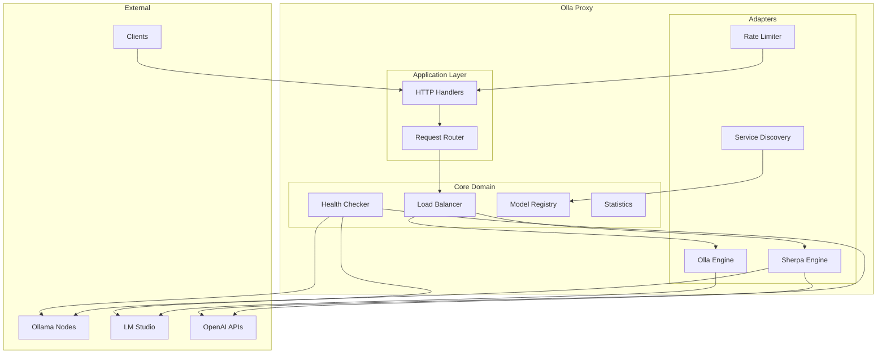
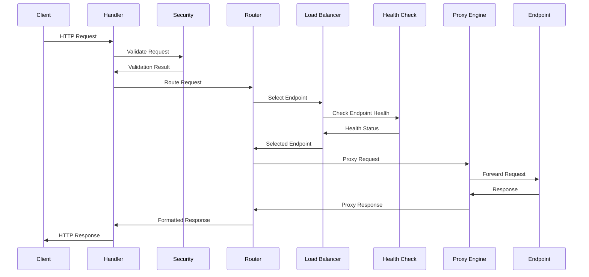
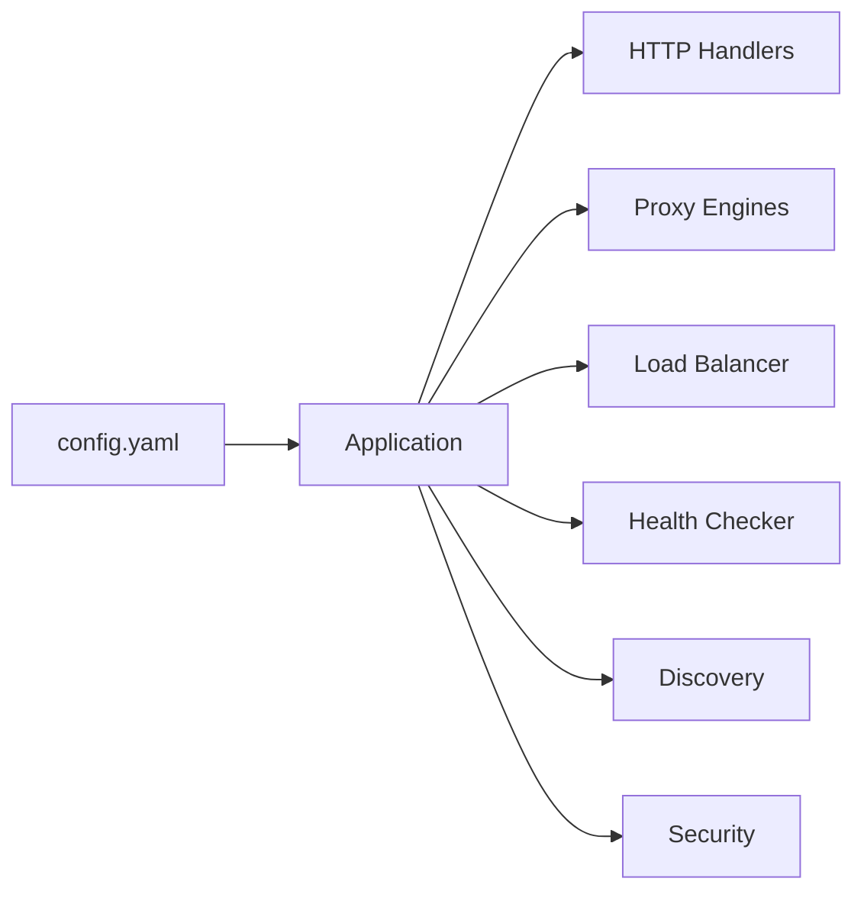

# Architecture

Olla follows **Hexagonal Architecture** (Ports & Adapters) principles, ensuring clean separation of concerns, testability, and maintainability.

## High-Level Architecture



## Hexagonal Architecture Implementation

### Layer Structure

```
┌─────────────────────────────────────────────────────────┐
│                    External Clients                      │
│         (CLI, API Clients, OpenWebUI, Continue)         │
└─────────────────────────┬───────────────────────────────┘
                          │
┌─────────────────────────▼───────────────────────────────┐
│                   Application Layer                      │
│                  (HTTP Handlers, Routes)                 │
│                   internal/app/handlers                  │
└─────────────────────────┬───────────────────────────────┘
                          │
┌─────────────────────────▼───────────────────────────────┐
│                      Core Domain                         │
│              (Business Logic, Entities, Ports)           │
│                     internal/core                        │
└──────┬──────────────────────────────────────┬───────────┘
       │                                      │
┌──────▼────────────┐                ┌───────▼───────────┐
│   Adapter Layer   │                │   Adapter Layer   │
│  (Proxy Engines)  │                │ (Load Balancers)  │
│ internal/adapter  │                │ internal/adapter  │
└───────────────────┘                └───────────────────┘
       │                                      │
┌──────▼────────────────────────────────────▼────────────┐
│                 External Systems                        │
│        (Ollama, LM Studio, vLLM, OpenAI API)          │
└─────────────────────────────────────────────────────────┘
```

### Key Principles

- **Dependencies point inward**: Core has no dependencies on outer layers
- **Ports define contracts**: Interfaces in core, implementations in adapters
- **Domain isolation**: Business logic independent of infrastructure
- **Testability**: Each layer can be tested in isolation

## Core Components

### Application Layer (`/internal/app/`)

The application layer handles HTTP requests and coordinates between components:

- **HTTP Handlers**: Process incoming requests and format responses
- **Request Router**: Routes requests to appropriate endpoints based on models and availability
- **Middleware**: Security, logging, and request validation
- **Service Manager**: Manages service lifecycle with dependency injection

### Core Domain (`/internal/core/`)

Contains the business logic and domain models.

#### Domain Entities

```go
// internal/core/domain/endpoint.go
type Endpoint struct {
    URL            string
    Name           string
    Type           EndpointType  // ollama, lm-studio, vllm, openai
    Priority       int
    Health         HealthStatus
    CircuitBreaker *CircuitBreaker
    Models         []Model
}

// internal/core/domain/model.go
type Model struct {
    ID           string
    Name         string
    Family       string      // llama, mistral, etc
    Size         int64       // Model size in bytes
    Capabilities []string    // vision, embeddings, code
    Context      int         // Context window size
    Endpoints    []string    // Available on these endpoints
}

// internal/core/domain/routing.go
type RoutingDecision struct {
    Endpoint    *Endpoint
    Model       string
    Strategy    string      // How the decision was made
    Alternatives []Endpoint  // Fallback options
}
```

#### Port Interfaces

Ports define contracts between layers:

```go
// internal/core/ports/proxy.go
type ProxyService interface {
    ProxyRequest(ctx context.Context, w http.ResponseWriter, 
                 r *http.Request, stats *RequestStats, 
                 logger StyledLogger) error
    GetStats(ctx context.Context) (ProxyStats, error)
    UpdateConfig(configuration ProxyConfiguration)
}

// internal/core/ports/discovery.go
type DiscoveryService interface {
    GetHealthyEndpoints(ctx context.Context) ([]*domain.Endpoint, error)
    RefreshEndpoints(ctx context.Context) error
    RegisterEndpoint(endpoint *domain.Endpoint) error
    UnregisterEndpoint(name string) error
}

// internal/core/ports/balancer.go
type EndpointSelector interface {
    Select(ctx context.Context, endpoints []*domain.Endpoint, 
           model string) (*domain.Endpoint, error)
    UpdateMetrics(endpoint string, latency time.Duration, success bool)
    GetType() string
}

// internal/core/ports/health.go
type HealthChecker interface {
    CheckEndpoint(ctx context.Context, endpoint *domain.Endpoint) error
    StartMonitoring(ctx context.Context) error
    GetStatus() map[string]HealthStatus
}
```

### Adapter Layer (`/internal/adapter/`)

Infrastructure implementations of the core ports.

#### Proxy Engines (`/internal/adapter/proxy/`)

Two implementations with different trade-offs:

**Sherpa Engine** - Simple and maintainable:
```go
type SherpaProxy struct {
    client     *http.Client      // Shared HTTP client
    bufferPool *pool.Pool[*[]byte]
    config     *Configuration
}

// Simple implementation with shared transport
func (s *SherpaProxy) ProxyRequest(ctx context.Context, 
    w http.ResponseWriter, r *http.Request, 
    stats *RequestStats, logger StyledLogger) error {
    req := s.createBackendRequest(r)
    resp, err := s.client.Do(req)
    if err != nil {
        return err
    }
    defer resp.Body.Close()
    
    return s.streamResponse(w, resp)
}
```

**Olla Engine** - High-performance:
```go
type OllaProxy struct {
    pools      map[string]*ConnectionPool  // Per-endpoint pools
    bufferPool *pool.Pool[*[]byte]
    config     *Configuration
}

// Advanced implementation with connection pooling
func (o *OllaProxy) ProxyRequest(ctx context.Context,
    w http.ResponseWriter, r *http.Request,
    stats *RequestStats, logger StyledLogger) error {
    pool := o.getPool(endpoint)
    conn := pool.Get()
    defer pool.Put(conn)
    
    return o.streamWithBackpressure(w, conn)
}
```

See [Proxy Engines](../concepts/proxy-engines.md) for detailed comparison.

#### Load Balancers (`/internal/adapter/balancer/`)

Three strategies available:

```go
// Priority balancer - selects highest priority
type PriorityBalancer struct {
    mu sync.RWMutex
}

func (p *PriorityBalancer) Select(ctx context.Context, 
    endpoints []*domain.Endpoint, model string) (*domain.Endpoint, error) {
    
    healthy := filterHealthy(endpoints)
    if len(healthy) == 0 {
        return nil, ErrNoHealthyEndpoints
    }
    
    // Sort by priority (highest first)
    sort.Slice(healthy, func(i, j int) bool {
        return healthy[i].Priority > healthy[j].Priority
    })
    
    return healthy[0], nil
}
```

- **Priority**: Select highest priority available endpoint
- **Round Robin**: Cycle through available endpoints
- **Least Connections**: Route to endpoint with fewest active connections

#### Health Checking (`/internal/adapter/health/`)

- Periodic health checks with configurable intervals
- Circuit breaker pattern for failing endpoints
- Automatic recovery detection
- Health status caching

#### Service Discovery (`/internal/adapter/discovery/`)

- **Static**: Configuration-based endpoint discovery
- **Dynamic**: Future support for service discovery systems
- Model discovery and registry updates

#### Security (`/internal/adapter/security/`)

- Rate limiting per IP and globally
- Request size validation
- Header validation
- Trusted proxy support

#### Statistics (`/internal/adapter/stats/`)

Lock-free atomic counters for performance:

```go
type StatsCollector struct {
    // Using xsync for lock-free operations
    endpoints *xsync.Map[string, *endpointStats]
    total     *xsync.Counter
}

type endpointStats struct {
    requests   int64  // atomic
    errors     int64  // atomic
    totalTime  int64  // atomic nanoseconds
    lastError  int64  // atomic unix timestamp
}

func (s *StatsCollector) RecordRequest(endpoint string, duration time.Duration, err error) {
    // Lock-free increment
    s.total.Add(1)
    
    // Get or create endpoint stats
    stats, _ := s.endpoints.LoadOrStore(endpoint, &endpointStats{})
    
    // Atomic updates
    atomic.AddInt64(&stats.requests, 1)
    atomic.AddInt64(&stats.totalTime, int64(duration))
    
    if err != nil {
        atomic.AddInt64(&stats.errors, 1)
        atomic.StoreInt64(&stats.lastError, time.Now().Unix())
    }
}
```

## Request Flow



### Request Processing Pipeline

```go
// Simplified request flow
func (h *ProxyHandler) ServeHTTP(w http.ResponseWriter, r *http.Request) {
    // 1. Extract request metadata
    ctx := context.WithValue(r.Context(), "request-id", generateID())
    
    // 2. Apply security policies
    if err := h.security.ValidateRequest(r); err != nil {
        http.Error(w, "Forbidden", http.StatusForbidden)
        return
    }
    
    // 3. Select endpoint
    endpoint, err := h.router.Route(ctx, r)
    if err != nil {
        http.Error(w, "No endpoints available", http.StatusServiceUnavailable)
        return
    }
    
    // 4. Proxy request
    stats := &RequestStats{StartTime: time.Now()}
    err = h.proxy.ProxyRequest(ctx, w, r, stats, h.logger)
    
    // 5. Record metrics
    h.stats.RecordRequest(endpoint, stats)
}
```

## Service Lifecycle

Services follow a managed lifecycle with dependency injection:

```go
// internal/app/app.go
type ManagedService interface {
    Name() string
    Dependencies() []string
    Start(ctx context.Context) error
    Stop(ctx context.Context) error
}

// Service Manager uses Kahn's algorithm for topological sorting
type ServiceManager struct {
    services  map[string]ManagedService
    order     []string  // Startup order
    mu        sync.RWMutex
}
```

The service manager:

- Resolves dependencies using topological sorting
- Starts services in dependency order
- Stops services in reverse order
- Handles graceful shutdown

## Concurrency Model

Olla uses Go's goroutine-based concurrency:

- **Request Handling**: Each request runs in its own goroutine
- **Health Checking**: Background goroutines monitor endpoint health
- **Statistics**: Lock-free atomic operations for high-performance metrics
- **Connection Pooling**: Shared connection pools across goroutines
- **Circuit Breakers**: Thread-safe state management

### Connection Pool Management

```go
type ConnectionPool struct {
    endpoint  string
    available chan net.Conn
    factory   ConnectionFactory
    
    // Metrics
    created   int64  // atomic
    active    int64  // atomic
    destroyed int64  // atomic
}

func (p *ConnectionPool) Get(ctx context.Context) (net.Conn, error) {
    select {
    case conn := <-p.available:
        if p.isHealthy(conn) {
            atomic.AddInt64(&p.active, 1)
            return conn, nil
        }
        p.destroy(conn)
        return p.create(ctx)
        
    case <-ctx.Done():
        return nil, ctx.Err()
        
    default:
        return p.create(ctx)
    }
}
```

## Memory Optimisation

### Object Pooling

Reducing GC pressure through object reuse:

```go
// Generic pool implementation
type Pool[T any] struct {
    pool sync.Pool
    new  func() T
    reset func(T)
}

// Buffer pool for streaming
var bufferPool = &Pool[*[]byte]{
    new: func() *[]byte {
        buf := make([]byte, 8192)
        return &buf
    },
    reset: func(buf *[]byte) {
        // Clear sensitive data
        clear(*buf)
    },
}
```

### Memory Layout Optimisation

```go
// Optimised struct layout for cache efficiency
type Endpoint struct {
    // Hot path fields (frequently accessed)
    Health    int32   // 4 bytes, atomic access
    Priority  int32   // 4 bytes, fits in same cache line
    
    // Warm path fields
    URL       string  // 16 bytes (string header)
    Name      string  // 16 bytes
    
    // Cold path fields (rarely accessed)
    Type      EndpointType
    Models    []Model
    CreatedAt time.Time
}
```

## Error Handling

Structured error handling throughout the system:

```go
// Domain errors
var (
    ErrNoHealthyEndpoints = errors.New("no healthy endpoints available")
    ErrCircuitOpen        = errors.New("circuit breaker is open")
    ErrModelNotFound      = errors.New("model not found")
    ErrTimeout            = errors.New("request timeout")
)

// Error wrapping for context
type ProxyError struct {
    Op       string    // Operation that failed
    Endpoint string    // Which endpoint
    Err      error     // Underlying error
    Time     time.Time // When it occurred
}

func (e *ProxyError) Error() string {
    return fmt.Sprintf("%s failed for %s: %v", e.Op, e.Endpoint, e.Err)
}
```

- **Graceful Degradation**: Continue serving from healthy endpoints
- **Circuit Breakers**: Automatically isolate failing endpoints
- **Retry Logic**: Configurable retry strategies with backoff
- **Error Propagation**: Structured error responses to clients

## Configuration Architecture

Configuration flows through the system using dependency injection:



## Observability

Built-in observability features:

- **Request Tracing**: Unique request IDs and correlation
- **Metrics**: Performance and health metrics
- **Logging**: Structured JSON logging
- **Health Endpoints**: `/internal/health` and `/internal/status`
- **Response Headers**: Debugging information in HTTP headers

## Testing Architecture

Comprehensive testing strategy:

- **Unit Tests**: Test individual components in isolation
- **Integration Tests**: Full request flow testing
- **Benchmark Tests**: Performance testing of critical paths
- **Contract Tests**: Ensure adapter implementations meet port contracts

### Contract Testing

Ensuring adapters meet port contracts:

```go
// Shared test suite for proxy implementations
func TestProxyContract(t *testing.T, factory ProxyFactory) {
    tests := []struct {
        name string
        test func(t *testing.T, proxy ports.ProxyService)
    }{
        {"handles successful request", testSuccessfulRequest},
        {"handles streaming response", testStreamingResponse},
        {"handles connection failure", testConnectionFailure},
        {"respects timeout", testTimeout},
        {"preserves headers", testHeaderPreservation},
    }
    
    for _, tt := range tests {
        t.Run(tt.name, func(t *testing.T) {
            proxy := factory.Create()
            tt.test(t, proxy)
        })
    }
}
```

## Performance Considerations

### Critical Path Optimisations

1. **Endpoint Selection**: O(1) for priority, O(n) worst case
2. **Health Checks**: Cached with TTL, async updates
3. **Statistics**: Lock-free atomic operations
4. **Connection Pooling**: Pre-warmed connections
5. **Buffer Management**: Object pooling to reduce allocations

## Security Considerations

- **Rate Limiting**: Protect against abuse and DoS
- **Request Validation**: Size limits and content validation  
- **Header Sanitisation**: Clean and validate HTTP headers
- **Circuit Breakers**: Protect downstream services
- **Trusted Proxies**: Secure proxy header handling

## Next Steps

- Review [Technical Patterns](patterns.md) for implementation patterns
- See [Circuit Breaker](circuit-breaker.md) for resilience patterns
- Check [Testing Guide](testing.md) for testing strategies
- Explore [Benchmarking](benchmarking.md) for performance testing