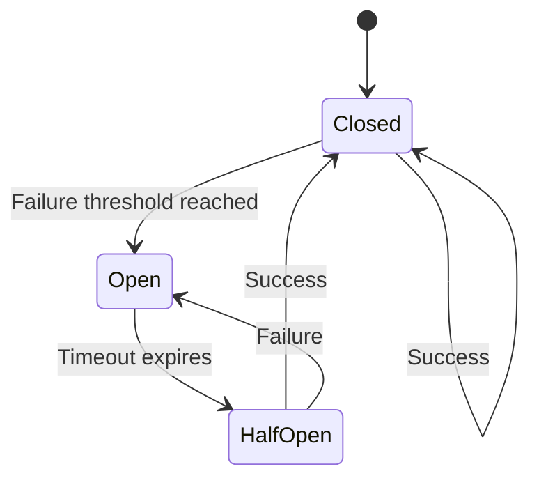
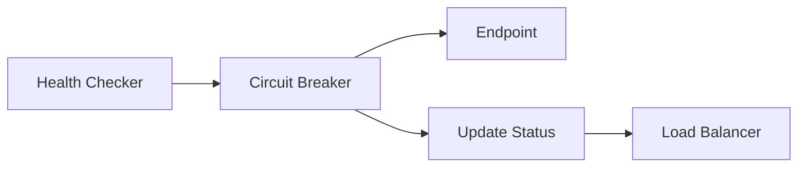

# Circuit Breaker

The circuit breaker pattern protects your LLM infrastructure by automatically isolating failing endpoints and allowing them to recover.

> :memo: **Default Configuration**
> ```yaml
> # Circuit breaker settings (hardcoded for reliability)
> # Failure threshold: 3 consecutive failures
> # Timeout: 30 seconds
> # Half-open test limit: 1 request
> ```
> **Key Settings**:
> 
> - Opens after 3 consecutive failures
> - Waits 30 seconds before testing recovery
> - Tests with 1 request in half-open state
> 
> **Note**: These values are currently hardcoded and not configurable via YAML or environment variables.

## How It Works

Olla implements a circuit breaker for each endpoint to prevent cascading failures:



### States

**Closed (Normal Operation)**

- Requests flow normally to the endpoint
- Failures are tracked
- Transitions to Open when failure threshold exceeded

**Open (Circuit Tripped)**

- All requests immediately fail without contacting endpoint
- Allows the endpoint time to recover
- Automatically transitions to Half-Open after timeout

**Half-Open (Testing Recovery)**

- Limited requests allowed through to test recovery
- Success transitions back to Closed
- Failure returns to Open state

## Implementation Details

The circuit breaker is implemented in `internal/adapter/health/circuit_breaker.go`:

```go
type CircuitBreaker struct {
    state           State
    failureCount    int64
    successCount    int64
    lastFailureTime time.Time
    halfOpenTests   int64
}
```

### Configuration

Circuit breaker parameters are currently hardcoded in the implementation:

| Parameter | Value | Description |
|-----------|-------|-------------|
| **Failure Threshold** | 3 consecutive failures | Trips the circuit |
| **Timeout** | 30 seconds | Time before testing recovery |
| **Half-Open Tests** | 3 successful requests | Required to close circuit |

### Failure Detection

The circuit breaker tracks these failure conditions:

- Connection timeouts
- HTTP 5xx responses
- Request timeouts
- Connection refused errors
- DNS resolution failures

### Recovery Process

1. After 30 seconds in Open state, transitions to Half-Open
2. Next request is allowed through as a test
3. If successful, allows more test requests
4. After 3 successful requests, circuit closes
5. Any failure returns to Open state

## Integration with Health Checking

The circuit breaker works alongside health checking:



- Health checks respect circuit breaker state
- Open circuits mark endpoints as unhealthy
- Load balancer avoids unhealthy endpoints
- Closed circuits allow normal health checking

## Observability

### Metrics

Circuit breaker state is tracked internally and affects:

- Endpoint health status in `/internal/status`
- Request routing decisions
- Structured logging

### Status Endpoint

The `/internal/status` endpoint shows endpoint health which reflects circuit breaker state:

```json
{
  "endpoints": [
    {
      "name": "local-ollama",
      "status": "unhealthy",
      "issues": "circuit breaker open"
    }
  ]
}
```

## Best Practices

### Tuning for Your Environment

While parameters are hardcoded, you can influence behaviour through:

1. **Health Check Intervals**: More frequent checks detect issues faster
2. **Request Timeouts**: Shorter timeouts trigger circuit breaker sooner
3. **Endpoint Priorities**: Route away from flaky endpoints

### Monitoring

Watch for these patterns:

- Frequent circuit trips indicate endpoint instability
- Long recovery times suggest capacity issues
- Cascading trips may indicate broader problems

### Testing Circuit Breakers

Test your circuit breaker behaviour:

```bash
# Simulate endpoint failure
docker stop ollama-instance

# Watch circuit breaker activate
curl http://localhost:40114/internal/status

# Restart endpoint
docker start ollama-instance

# Monitor recovery
watch -n 1 curl http://localhost:40114/internal/status
```

## Limitations

Current implementation limitations:

- Parameters not configurable via YAML
- No per-endpoint customisation
- No circuit breaker events or webhooks
- Half-open state testing is conservative

## Future Enhancements

Planned improvements:

- Configurable thresholds and timeouts
- Per-endpoint circuit breaker settings
- Circuit breaker events for monitoring
- Adaptive thresholds based on load
- Manual circuit breaker control API

## Related Documentation

- [Health Checking](../concepts/health-checking.md) - Endpoint monitoring
- [Load Balancing](../concepts/load-balancing.md) - Request distribution
- [Architecture Overview](overview.md) - System design

## Technical Reference

For implementation details, see:

- `internal/adapter/health/circuit_breaker.go` - Core implementation
- `internal/adapter/health/checker.go` - Integration with health checking
- `internal/adapter/balancer/` - Load balancer integration