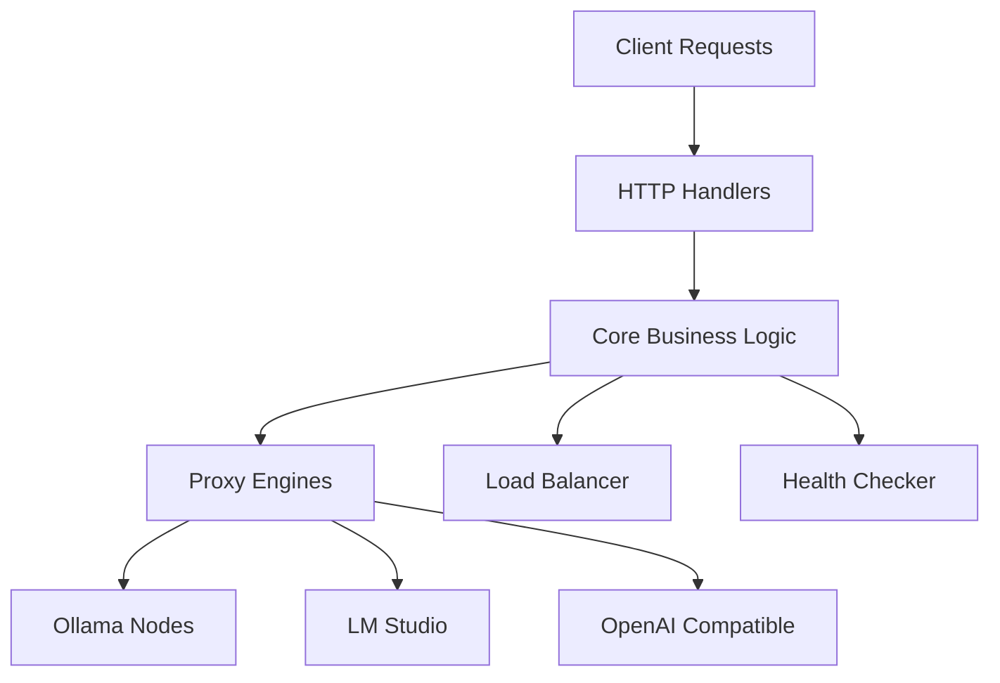

## Architecture

Olla follows **Hexagonal Architecture** (Ports & Adapters) for maintainability and testability:

```mermaid
graph TB
    Client[Client Requests] --> Handler[HTTP Handlers]
    Handler --> Core[Core Business Logic]
    Core --> Proxy[Proxy Engines]
    Core --> Balancer[Load Balancer]
    Core --> Health[Health Checker]
    Proxy --> Ollama[Ollama Nodes]
    Proxy --> LMStudio[LM Studio]
    Proxy --> OpenAI[OpenAI Compatible]
```
