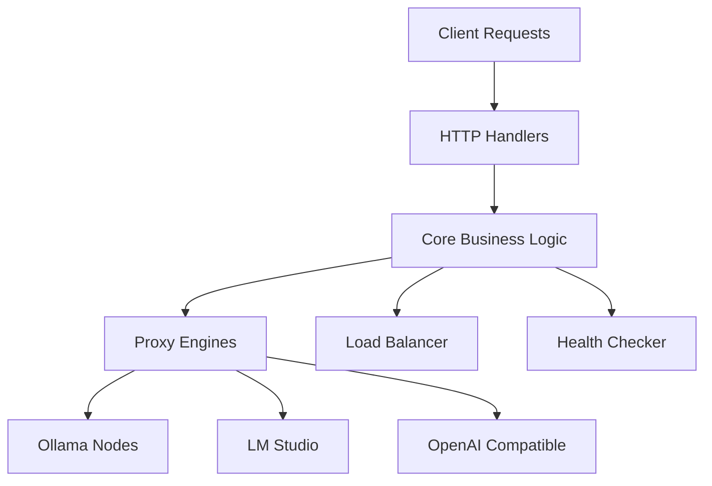

# Olla


[](https://golang.org/)
[](LICENSE)

A high-performance proxy and load balancer for LLM infrastructure, written in Go. Olla intelligently routes requests across local and remote inference nodes including Ollama, LM Studio, and OpenAI-compatible endpoints.

## Key Features

- **Dual Proxy Engines**: Choose between Sherpa (simple, maintainable) and Olla (high-performance with advanced features)
- **Intelligent Load Balancing**: Priority-based, round-robin, and least-connections strategies
- **Health Monitoring**: Circuit breakers and automatic failover
- **High Performance**: Connection pooling, object pooling, and lock-free statistics
- **Security**: Built-in rate limiting and request validation
- **Observability**: Comprehensive metrics and request tracing

## Architecture

Olla follows **Hexagonal Architecture** (Ports & Adapters) for maintainability and testability:



## Quick Start

Get up and running with Olla in minutes:

=== "Using Go"

    ```bash
    go install github.com/thushan/olla@latest
    olla --config config.yaml
    ```

=== "Using Docker"

    ```bash
    docker run -p 8080:8080 -v $(pwd)/config.yaml:/config.yaml thushan/olla
    ```

=== "From Source"

    ```bash
    git clone https://github.com/thushan/olla.git
    cd olla
    make dev
    ```

## Response Headers

Olla provides detailed response headers for observability:

| Header | Description |
|--------|-------------|
| `X-Olla-Endpoint` | Backend endpoint name |
| `X-Olla-Model` | Model used for the request |
| `X-Olla-Backend-Type` | Backend type (ollama/openai/lmstudio) |
| `X-Olla-Request-ID` | Unique request identifier |
| `X-Olla-Response-Time` | Total processing time |

## Why Olla?

- **Production Ready**: Built for high-throughput production environments
- **Flexible**: Works with any OpenAI-compatible endpoint
- **Observable**: Rich metrics and tracing out of the box
- **Reliable**: Circuit breakers and automatic failover
- **Fast**: Optimised for minimal latency and maximum throughput

## Next Steps

- [Installation Guide](getting-started/installation.md) - Get Olla installed
- [Quick Start](getting-started/quickstart.md) - Basic setup and configuration
- [Architecture Overview](architecture/overview.md) - Understand how Olla works
- [Configuration Reference](config/reference.md) - Complete configuration options

## Community

- 🐛 [Report Issues](https://github.com/thushan/olla/issues)
- 💡 [Feature Requests](https://github.com/thushan/olla/discussions)
- 📖 [Documentation](https://thushan.github.io/olla/)
- ⭐ [Star on GitHub](https://github.com/thushan/olla)