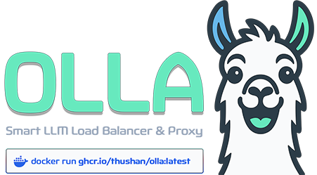

<div align="center">
  
  <p>
    <a href="https://github.com/thushan/olla/blob/master/LICENSE"></a>
    <a href="https://golang.org/"></a>
    <a href="https://github.com/thushan/olla/actions/workflows/ci.yml"></a>
    <a href="https://goreportcard.com/report/github.com/thushan/olla"></a>
    <a href="https://github.com/thushan/olla/releases/latest"></a> <br />
    <a href="https://ollama.com"></a> 
    <a href="https://lmstudio.ai/"></a> 
    <a href="https://github.com/vllm-project/vllm"></a> 
    <a href="https://github.com/BerriAI/litellm"></a> 
    <a href="https://github.com/lemonade-sdk/lemonade"></a> 
    <a href="https://github.com/InternLM/lmdeploy"></a> 
  </P>
</div>

Olla is a high-performance, low-overhead, low-latency proxy, model unifier and load balancer for managing LLM infrastructure. 

It intelligently routes LLM requests across local and remote inference nodes - including [Ollama](https://github.com/ollama/ollama), [LM Studio](https://lmstudio.ai/), [LiteLLM](https://github.com/BerriAI/litellm) (100+ cloud providers), and OpenAI-compatible endpoints like [vLLM](https://github.com/vllm-project/vllm). Olla provides model discovery and unified model catalogues across all providers, enabling seamless routing to available models on compatible endpoints.

With native [LiteLLM support](integrations/backend/litellm.md), Olla bridges local and cloud infrastructure - use local models when available, automatically failover to cloud APIs when needed. Unlike orchestration platforms like [GPUStack](compare/gpustack.md), Olla focuses on making your existing LLM infrastructure reliable through intelligent routing and failover.

## Key Features

- **Unified Model Registry**: Unifies models registered across instances (of the same type - Eg. Ollama or LMStudio)
- **Dual Proxy Engines**: Choose between Sherpa (simple, maintainable) and Olla (high-performance with advanced features)
- **Intelligent Load Balancing**: Priority-based, round-robin, and least-connections strategies
- **Health Monitoring**: Circuit breakers and automatic failover
- **High Performance**: Connection pooling, object pooling, and lock-free statistics
- **Security**: Built-in rate limiting and request validation
- **Observability**: Comprehensive metrics and request tracing

## Core Concepts

Understand these key concepts to get the most from Olla:

- **[Proxy Engines](concepts/proxy-engines.md)** - Choose between Sherpa (simple) or Olla (high-performance) engines
- **[Proxy Profiles](concepts/proxy-profiles.md)** - Learn about different proxy behaviours for streaming or buffering
- **[Load Balancing](concepts/load-balancing.md)** - Distribute requests across multiple endpoints
- **[Model Routing](concepts/model-routing.md)** - Different ways Olla routes traffic based on model availability & health
- **[Model Unification](concepts/model-unification.md)** - Single catalogue of models across all your backends
- **[Health Checking](concepts/health-checking.md)** - Automatic endpoint monitoring and intelligent failover
- **[Profile System](concepts/profile-system.md)** - Customise backend behaviour without writing code

---

## Quick Start

Get up and running with Olla in minutes:

=== "Installer"    
    ```bash
    # Linux/macOS
    bash <(curl -s https://raw.githubusercontent.com/thushan/olla/main/install.sh)
    ```
=== "Using Docker"
    ```bash
    # If you have ollama or lmstudio locally
    docker run -t -p 40114:40114 ghcr.io/thushan/olla:latest
    ```

=== "Using Go"

    ```bash
    go install github.com/thushan/olla@latest
    olla
    ```

=== "From Binaries"

    <small>Visit [Github Releases](https://github.com/thushan/olla/releases/latest)</small>

=== "From Source"

    ```bash
    git clone https://github.com/thushan/olla.git
    cd olla
    make build-release
    ./olla
    ```

## Response Headers

Olla provides detailed response headers for observability:

| Header | Description |
|--------|-------------|
| `X-Olla-Endpoint` | Backend endpoint name |
| `X-Olla-Model` | Model used for the request |
| `X-Olla-Backend-Type` | Backend type (ollama/openai/lmstudio/vllm/litellm) |
| `X-Olla-Request-ID` | Unique request identifier |
| `X-Olla-Response-Time` | Total processing time |

## Why Olla?

- **Production Ready**: Built for high-throughput production environments
- **Flexible**: Works with any OpenAI-compatible endpoint
- **Observable**: Rich metrics and tracing out of the box
- **Reliable**: Circuit breakers and automatic failover
- **Fast**: Optimised for minimal latency and maximum throughput

See how Olla compares to [LiteLLM](compare/litellm.md), [GPUStack](compare/gpustack.md) and [LocalAI](compare/localai.md) in our [comparison guide](compare/overview.md).

## Next Steps

- [Installation Guide](getting-started/installation.md) - Get Olla installed
- [Quick Start](getting-started/quickstart.md) - Basic setup and configuration
- [Architecture Overview](development/architecture.md) - Understand how Olla works
- [Configuration Reference](configuration/reference.md) - Complete configuration options

## Community

- 🐛 [Report Issues](https://github.com/thushan/olla/issues)
- 💡 [Feature Requests](https://github.com/thushan/olla/discussions)
- 📖 [Documentation](https://thushan.github.io/olla/)
- ⭐ [Star on GitHub](https://github.com/thushan/olla)