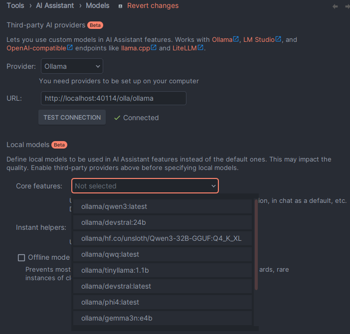
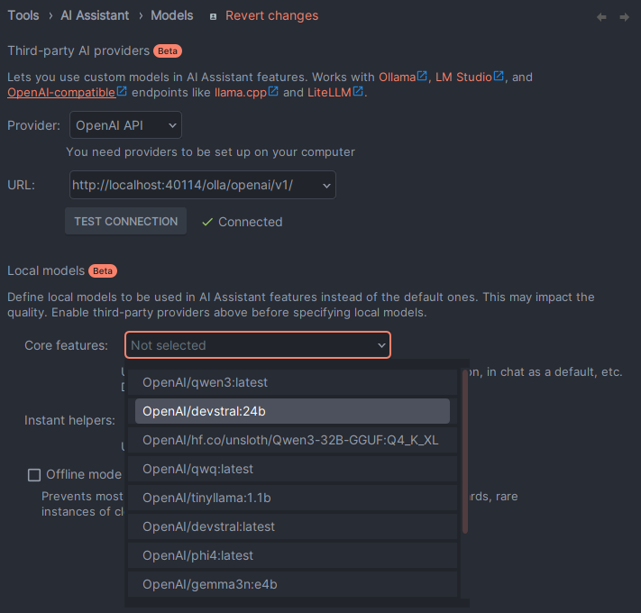

# Uses of Olla (and Similar Local LLM Proxies)

LLM proxies like **Olla**, **Sherpa** and **Scout** are designed for **local-first AI deployments** - running entirely on infrastructure you control.

They make it easier to adopt and manage local models in corporate or home environments, where privacy, compliance and performance are critical.

## Why Local AI Matters

More companies are moving workloads to local or on-premises (or own-cloud hosted) models because they offer:

* **Data privacy** – Sensitive information stays inside your network.
* **Compliance** – Easier to meet regulatory requirements without sending data to third-party APIs.
* **Cost control** – No unpredictable API bills; you pay once for hardware and run as much as you like.
* **Latency** – Responses are generated within your own LAN, not across the internet.
* **Customisation** – Fine-tune or swap models without vendor lock-in.

## Use Cases

### 🏠 Home Lab & Personal Use

Perfect for enthusiasts running multiple LLM instances:

- **Multi-GPU Setups**: Route between different models on various GPUs
- **Model Experimentation**: Easy switching between Ollama, LM Studio and OpenAI backends  
- **Resource Management**: Automatic failover when local resources are busy
- **Cost Optimisation**: Priority routing (local first, cloud fallback via native [LiteLLM](integrations/backend/litellm.md) support)
- **Hybrid Cloud**: Access GPT-4, Claude, and 100+ cloud models when needed

```yaml
# Home lab config - local first, cloud fallback
discovery:
  type: "static"
  static:
    endpoints:
      - name: "rtx-4090-mobile"
        url: "http://localhost:11434" 
        type: "ollama"
        priority: 100  # Highest priority - use local when available
        
      - name: "home-lab-rtx-6000"
        url: "https://192.168.0.1:11434"
        type: "ollama"
        priority: 80   # Second choice
        
      - name: "litellm-cloud"
        url: "http://localhost:4000"
        type: "litellm"  # Native LiteLLM support
        priority: 50     # Cloud APIs as last resort
        model_url: "/v1/models"
        health_check_url: "/health"
```

### 🏢 Business & Teams

Streamline AI infrastructure for growing teams:

- **Department Isolation**: Route different teams to appropriate endpoints
- **Budget Controls**: Rate limiting and usage tracking per team
- **High Availability**: Load balancing across multiple inference servers
- **Development Staging**: Separate dev/staging/prod model routing

```yaml
# Business config - load balanced production
proxy:
  load_balancer: "least-connections"
server:
  rate_limits:
    per_ip_requests_per_minute: 100
    global_requests_per_minute: 1000
```

### ☁️ Hybrid Cloud Integration

Seamlessly combine local and cloud models with native LiteLLM support:

- **Smart Routing**: Use local models for sensitive data, cloud for complex tasks
- **Cost Control**: Prioritise free local models, failover to paid APIs
- **Best-of-Both**: GPT-4 for coding, local Llama for chat, Claude for analysis
- **Unified Interface**: One API endpoint for all models (local and cloud)

```yaml
# Hybrid setup with LiteLLM
discovery:
  type: "static"
  static:
    endpoints:
      # Local models for privacy/cost
      - name: "local-ollama"
        url: "http://localhost:11434"
        type: "ollama"
        priority: 100
        
      # LiteLLM gateway to cloud providers
      - name: "litellm-gateway"
        url: "http://localhost:4000"
        type: "litellm"
        priority: 75
        
# Single endpoint accesses all models
# http://localhost:40114/olla/openai/v1/chat/completions
# Automatically routes to the right backend based on model name
```

### 🏭 Enterprise & Production

Mission-critical AI infrastructure at scale:

- **Multi-Region Deployment**: Geographic load balancing and failover
- **Enterprise Security**: Rate limiting, request validation, audit trails  
- **Performance Monitoring**: Circuit breakers, health checks, metrics
- **Vendor Diversity**: Mix of cloud providers (via LiteLLM) and on-premise infrastructure

```yaml
# Enterprise config - high performance, observability
proxy:
  engine: "olla"  # High-performance engine
  # Automatic retry is enabled by default for connection failures
server:
  request_logging: true
  rate_limits:
    global_requests_per_minute: 10000
```

## How Olla is Used

Olla sits between your applications and local AI runtimes (eg. Ollama, LM Studio, vLLM etc) to:

* **Unify multiple local backends** under one consistent API.
* **Route intelligently** between models based on size, speed, and task fit.
* **Enforce configuration and policy** centrally for all AI requests.
* **Expose metrics** so you can track performance and usage.
* **Stream responses efficiently** for low-latency interactive use.

For cloud API management, consider [LiteLLM](compare/litellm.md). For GPU cluster orchestration, see [GPUStack](compare/gpustack.md). Olla can work alongside these tools - see our [integration patterns](compare/integration-patterns.md).

## Customer Usage Scenarios

* A security-conscious company runs several Ollama and LM Studio instances on internal GPU servers, with Olla routing requests to the right model.
* An engineering team uses Olla to test multiple LLM builds locally without changing client applications.
* A research group runs large local models on a shared HPC cluster, with Olla handling access control and usage tracking.

From a more home / work scenario, users run Olla containerised locally with configurations for various endpoints to seamlessly change between Home AI inference machines and corporate work enabled endpoints.

This allows you to configure your tools to point to Olla, then let Olla unify models and direct traffic to available nodes.

## Example Integration

For home/personal use, if you have work provisioned or home (or local) provisioned hardware, you can create a profile in Olla like this:

```yaml
discovery:
  type: "static"
  static:
    endpoints:
      - url: "http://localhost:11434"
        name: "local-ollama"
        type: "ollama"
        priority: 50
      - url: "http://localhost:1234"
        name: "local-lm-studio"
        type: "lmstudio"
        priority: 50
      - url: "http://corp-ollama.acmecorp.com:11434"
        name: "work-ollama"
        type: "ollama"
        priority: 100
      - url: "http://corp-lmstudio.acmecorp.com:1234"
        name: "local-lm-studio"
        type: "work-lmstudio"
        priority: 100
```

Then use tools that rely on specific backends or OpenAI compatible APIs easily.

### Development Tools : Junie

A great example of using Olla 'in the middle' would be for [JetBrains Junie](https://www.jetbrains.com/junie/).

Junie supports Ollama, LMStudio and OpenAI compatible API for local-ai.

**Configure Ollama**



**Configure OpenAI**



This way, if you're at home (and considering you can't access `corp-*.acmecorp.com`) Olla will route you through to your local endpoints, at work it will automatically prioritise those endpoints.