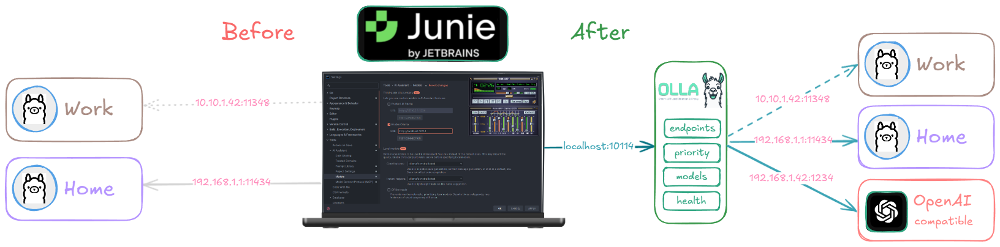

<div align="center">
    
  <p>
    <a href="https://github.com/thushan/olla/blob/master/LICENSE"></a>
    <a href="https://github.com/thushan/olla/actions/workflows/ci.yml"></a>
    <a href="https://goreportcard.com/report/github.com/thushan/olla"></a>
    <a href="https://github.com/thushan/olla/releases/latest"></a>
  </p>
</div>

> [!IMPORTANT]  
> Olla is currently **in-development**. While it is usable, we are still finalising some features and optimisations. Your feedback is invaluable!

Olla is a high-performance, low-overhead, low-latency proxy and load balancer for managing LLM infrastructure. It intelligently routes LLM requests across local and remote inference nodes—including Ollama, LM Studio, and OpenAI-compatible endpoints out of the box, with more front-ends coming soon.



Whether you're running workloads on laptops, workstations, or clustered servers, Olla dynamically selects the best endpoint using configurable priorities, health checks, and load-aware strategies. With built-in failover, adaptive routing, and continuous monitoring, it ensures resilience, performance, and minimal operational complexity. Single CLI application and config file is all you need to go Olla!

## ✨ Features

We're still busy working on features and would love to hear your thoughts on what you'd like from Olla in the future!

### 🎯 **Smart Load Balancing**
- **Priority-based routing**: Configure node priorities (workstation first, laptop second) with automatic failover
- **Multiple strategies**: Round-robin, least connections, and priority-aware load balancing
- **Health-aware routing**: Only routes to healthy endpoints, with automatic recovery detection
- **Model-aware routing**: 🚧 Intelligently route to endpoints which have the model you've requested

### 🛡️ **In-built Security**
- **Rate limiting**: Per-IP and global request limits with burst handling
- **Request size limits**: Protect against oversized requests and headers
- **Trusted proxy support**: Works seamlessly behind reverse proxies and CDNs

### 🔍 **Comprehensive Monitoring**
- **Health checking**: Continuous endpoint monitoring with configurable intervals
- **Model discovery**: Automatic detection of available models across endpoints
- **Detailed metrics**: Request stats, response times, and performance insights

### ⚙️ **Easy Configuration**
- **Single Configuration File**: Easily manage server with a single configuration file
- **Environment variables**: Override any setting with environment variables
- **Docker-ready**: One-command deployment with Docker Compose

### 🔌 **Universal Compatibility**
- **Ollama**: Full support for Ollama endpoints
- **LM Studio**: Seamless integration with LM Studio
- **OpenAI-compatible**: Works with any OpenAI-compatible API

## ⚡ **High Performance**
- **Lightweight**: Optimised memory & cpu footprint, can sip on RAM with 1000s of concurrent requests.
- **Low latency**: Sub-millisecond endpoint selection with minimal proxy overhead
- **Memory optimised**: Efficient buffer pooling and zero-copy streaming where possible
- **Concurrent**: Handles thousands of simultaneous streaming connections
- **Resource efficient**: Stable memory usage under load with automatic clean-up

## 🔧 **Optimised for LLMs**
- **Streaming-first**: Immediate response streaming without buffering delays
- **Long-running requests**: Optimised timeouts for extended LLM inference times
- **Connection pooling**: Persistent connections to backend endpoints reduce latency
- **Circuit breakers**: Automatic failover prevents cascade delays

## 🚀 Quick Start

### Docker (Recommended)

Olla comes with a pre-configured docker configuration which proxies your local Ollama or LM Studio instance.

```bash
# Pull and run Olla
docker run -d \
  --name olla \
  -p 19841:19841 \
  -e OLLA_SERVER_HOST=0.0.0.0 \
  -e OLLA_CONFIG_FILE=config/docker.yaml \
  ghcr.io/thushan/olla:latest

# Check if it's running
curl http://localhost:19841/internal/health
```

### Docker Compose

Create a `docker-compose.yml`:

```yaml
services:
  olla:
    image: ghcr.io/thushan/olla:latest
    ports:
      - "19841:19841"
    environment:
      - OLLA_SERVER_HOST=0.0.0.0
      - OLLA_LOGGING_LEVEL=info
      - OLLA_CONFIG_FILE=config/docker.yaml
    volumes:
      - ./config:/app/config
      - ./logs:/app/logs
    restart: unless-stopped
```

Then run:
```bash
docker-compose up -d
```

### Local Binary

You can also run Olla directly on your machine without Docker. 

```bash
bash <(curl -s https://raw.githubusercontent.com/thushan/olla/main/install.sh)
```

It will download the latest version & extract it to its own folder for you.

If you prefer running Olla directly on your machine, download a pre-built binary.

1. Download the latest release from [Releases](https://github.com/thushan/olla/releases)
2. Extract the archive and navigate to the directory 
3. Verify the configuration in `config/config.yaml` and run:

```bash
./olla
```

Alternatively, you can install it via go:

```bash
go install github.com/thushan/olla@latest
```

### Build from Source

```bash
# Clone the repository
git clone https://github.com/thushan/olla.git
cd olla

# Install dependencies
make deps

# Run with default settings (connects to localhost:11434)
make run

# Or build and run
make build
./bin/olla
```

## 📝 Configuration

Olla uses a layered configuration approach: defaults → YAML config → environment variables (highest priority).

### Basic Configuration

Create `config/config.yaml`:

```yaml
server:
  host: "0.0.0.0"
  port: 19841
  read_timeout: 30s
  write_timeout: 0s  # Important: Leave as 0s for streaming LLM responses

proxy:
  load_balancer: "priority"  # or "round_robin", "least_connections"
  response_timeout: 900s     # 15 minutes for long LLM responses
  stream_buffer_size: 8192

discovery:
  static:
    endpoints:
      - url: "http://192.168.1.100:11434"
        name: "workstation-ollama"
        type: "ollama"
        priority: 100          # Higher number = higher priority
        health_check_url: "/"
        model_url: "/api/tags"
        check_interval: 5s
        check_timeout: 2s
      
      - url: "http://192.168.1.101:1234"
        name: "laptop-lmstudio"
        type: "lm-studio"
        priority: 50           # Lower priority fallback
        health_check_url: "/"
        model_url: "/v1/models"
        check_interval: 10s
        check_timeout: 3s
```

### Environment Variables

Common settings you'll want to override:

```bash
# Server settings
export OLLA_SERVER_HOST="0.0.0.0"
export OLLA_SERVER_PORT="19841"

# Proxy settings
export OLLA_PROXY_LOAD_BALANCER="priority"
export OLLA_PROXY_RESPONSE_TIMEOUT="15m"

# Rate limiting (optional but recommended)
export OLLA_SERVER_GLOBAL_RATE_LIMIT="1000"    # requests per minute
export OLLA_SERVER_PER_IP_RATE_LIMIT="100"     # requests per minute per IP
export OLLA_SERVER_TRUST_PROXY_HEADERS="true"  # if behind reverse proxy

# Security (optional)
export OLLA_SERVER_MAX_BODY_SIZE="50MB"
export OLLA_SERVER_MAX_HEADER_SIZE="1MB"

# Logging
export OLLA_LOGGING_LEVEL="info"  # debug, info, warn, error
export OLLA_LOGGING_FORMAT="json" # json or text
```

## ⚖️ Load Balancing Strategies

Choose the right strategy for your setup:

### 🎯 Priority (`priority`) - **Recommended**
Routes requests to the highest priority healthy endpoint. Perfect for:
- **Home setups**: Workstation (priority 100) → Laptop (priority 50)
- **Tiered infrastructure**: GPU servers → CPU servers → Cloud endpoints
- **Cost optimization**: Local hardware → Expensive cloud APIs

```yaml
load_balancer: "priority"
```

### 🔄 Round Robin (`round_robin`)
Distributes requests evenly across all healthy endpoints. Good for:
- **Equal hardware**: Multiple identical servers
- **Even load distribution**: When all endpoints have similar capacity
- **Simple load spreading**: No complex routing logic needed

```yaml
load_balancer: "round_robin"
```

### 📊 Least Connections (`least_connections`)
Routes to the endpoint with fewest active requests. Ideal for:
- **Mixed workloads**: Different request types with varying processing times
- **Dynamic balancing**: Automatically adapts to endpoint performance
- **Optimal resource utilisation**: Prevents any single endpoint from being overwhelmed

```yaml
load_balancer: "least_connections"
```

## 🔗 Usage

Once Olla is running, point your LLM clients to it instead of directly to Ollama:

### OpenAI-compatible Clients

```python
import openai

client = openai.OpenAI(
    base_url="http://localhost:19841/olla/v1",  # Point to Olla
    api_key="dummy"  # Ollama doesn't need auth
)

response = client.chat.completions.create(
    model="llama3.2",
    messages=[{"role": "user", "content": "Hello from Olla!"}]
)
```

### Curl

```bash
# Chat completions
curl -X POST http://localhost:19841/olla/v1/chat/completions \
  -H "Content-Type: application/json" \
  -d '{
    "model": "llama3.2",
    "messages": [{"role": "user", "content": "Hello!"}]
  }'

# Ollama generate API
curl -X POST http://localhost:19841/olla/api/generate \
  -H "Content-Type: application/json" \
  -d '{
    "model": "llama3.2",
    "prompt": "Hello!"
  }'
```

### Direct Model Switching

Olla automatically routes requests to endpoints that have the requested model:

```bash
# This will route to whichever endpoint has 'codellama'
curl -X POST http://localhost:19841/olla/v1/chat/completions \
  -d '{"model": "codellama", "messages": [...]}'
```

## 📊 Monitoring

### Health and Status

```bash
# Quick health check
curl http://localhost:19841/internal/health

# Detailed status including endpoint health
curl http://localhost:19841/internal/status | jq

# Application version and build info
curl http://localhost:19841/version | jq
```

### Process Statistics

```bash
# Runtime stats (memory, GC, goroutines)
curl http://localhost:19841/internal/process | jq
```

### Example Status Response

```json
{
  "endpoints": [
    {
      "name": "workstation-ollama",
      "url": "http://192.168.1.100:11434",
      "status": "healthy",
      "priority": 100,
      "last_latency": "45ms",
      "consecutive_failures": 0
    }
  ],
  "proxy": {
    "load_balancer": "priority",
    "total_requests": 1247,
    "successful_requests": 1245,
    "failed_requests": 2,
    "avg_latency_ms": 156
  },
  "total_endpoints": 2,
  "healthy_endpoints": 1,
  "routable_endpoints": 1
}
```

## 🛠️ Development

### Building

```bash
# Install dependencies
make deps

# Run tests
make test

# Run with race detection
make test-race

# Build optimised binary
make build

# Run with debug logging
make run-debug

# See all available targets
make help
```

### Project Structure

```
├── internal/               # Private application code (Go convention)
│   ├── adapter/            # External integrations and infrastructure
│   │   ├── balancer/       # Load balancing strategies (priority, round-robin, least-conn)
│   │   ├── discovery/      # Service discovery and endpoint management
│   │   ├── health/         # Health checking with circuit breakers
│   │   ├── proxy/          # HTTP proxy implementation (Sherpa/Olla engines)
│   │   ├── registry/       # Model registry and platform profiles
│   │   └── security/       # Rate limiting and request validation
│   ├── app/                # Application assembly and HTTP handlers
│   ├── config/             # Configuration management
│   ├── core/               # Business logic and domain models
│   │   ├── constants/      # Application constants
│   │   ├── domain/         # Domain entities and interfaces
│   │   └── ports/          # Interface definitions (ports & adapters pattern)
│   ├── env/                # Environment variable utilities
│   ├── integration/        # Integration test helpers
│   ├── logger/             # Structured logging with themes
│   ├── router/             # HTTP route registry and middleware
│   ├── util/               # Common utilities (networking, terminal detection)
│   └── version/            # Version information and build metadata
├── pkg/                    # Public packages (reusable components)
│   ├── format/             # Formatting utilities (bytes, duration)
│   └── nerdstats/          # Runtime statistics and performance metrics
├── test/                   # Test suites and testing utilities
│   └── scripts/            # Test automation scripts
│       ├── load/           # Load testing scripts
│       └── security/       # Security validation tests
└── theme/                  # Terminal theming and color schemes
```

## 🔧 Advanced Configuration

### Rate Limiting

Protect your endpoints from abuse:

```yaml
server:
  rate_limits:
    global_requests_per_minute: 1000      # Total requests across all IPs
    per_ip_requests_per_minute: 100       # Per-IP limit
    burst_size: 50                        # Allow bursts up to this size
    health_requests_per_minute: 1000      # Separate limit for health checks
    trust_proxy_headers: true             # For X-Forwarded-For support
    trusted_proxy_cidrs:                  # Which proxies to trust
      - "127.0.0.0/8"
      - "10.0.0.0/8"
      - "172.16.0.0/12"
      - "192.168.0.0/16"
```

### Request Size Limits

Prevent resource exhaustion:

```yaml
server:
  request_limits:
    max_body_size: 50MB      # Maximum request body size
    max_header_size: 1MB     # Maximum total header size
```

### Model Discovery

Automatically discover available models:

```yaml
discovery:
  model_discovery:
    enabled: true
    interval: 5m              # How often to check for new models
    timeout: 30s              # Timeout for discovery requests
    concurrent_workers: 5     # Parallel discovery workers
    retry_attempts: 3
    retry_backoff: 1s
```

## 🚨 Security Considerations

Olla is designed to sit behind a reverse proxy (nginx, Cloudflare, etc.) in production. The built-in security features are optimised for this deployment pattern:

- **Rate limiting**: Protects against request flooding
- **Request size limits**: Prevents resource exhaustion
- **Trusted proxy support**: Correctly handles client IPs behind load balancers
- **No authentication**: Relies on your reverse proxy for authentication

## 🤔 FAQ

**Q: Why use Olla instead of nginx or HAProxy?**
A: Olla understands LLM-specific patterns like model routing, streaming responses, and health semantics. It also provides built-in model discovery and LLM-optimised timeouts.

**Q: Can I use Olla with other LLM providers?**
A: Yes! Any OpenAI-compatible API works. Configure them as `type: "openai-compatible"` endpoints.

**Q: Does Olla support authentication?**
A: Olla focuses on load balancing and lets your reverse proxy handle authentication. This follows the Unix philosophy of doing one thing well.

**Q: How does priority routing work with model availability?**
A: (as of June 2025) Olla doesn't yet support model routing, but the goal is to have Olla first filter endpoints that have the requested model, then applies your chosen load balancing strategy within that subset.

**Q: Can I run Olla in Kubernetes?**
A: Absolutely! Olla is stateless and containerised. We'll add some examples soon - but if you'd like to share, PR away!

**Q: What is the reference to Sherpa?**
A: Sherpa is the precursor to Olla, that has now grown into a large tool that encompasses a lot more than just a proxy. The proxy feature was only added to Sherpa in early 2024 but internally (at our work), it was the most popular across teams. Olla shares a lot of the core from Sherpa (including its proxy engine).

**Q: What is behind the name Olla?**
A: Olla is the name of our llama (featured in the logo), and a running joke from a teammate who'd say, "Can't get it working on Olla(ma)." It's pronounced like 'holla'. The Spanish meaning (pot) is purely coincidental—we weren't high or anything. That said, you can cook up a lot when Olla is in the middle.

## 🤝 Contributing

We welcome contributions! Whether it's:

- 🐛 Bug reports and fixes
- ✨ Feature requests and implementations
- 📖 Documentation improvements
- 🧪 Test coverage enhancements

Please open an issue first to discuss major changes.

## 🤖 AI Disclosure

Sherpa and Olla have been built using AI, we have utilised AI to generate documentation, refine our tests and conduct code reviews.

We've utilised:

* [Github Copilot](https://github.com/features/copilot) - Most of our documentation (code and markdown)
* [Anthropic Claude](https://www.claude.ai) - Code reviews, unit test plumbing / refactoring, external test scripts (shell scripts)
* [OpenAI ChatGPT](https://chatgpt.com/) - Code reviews, document refinement, troubleshooting

Claude was used via [JetBrains Junie](https://www.jetbrains.com/junie/) in our development IDE, [GoLand](https://www.jetbrains.com/go/).

## 🙏 Acknowledgements

This project was possible thanks to the following projects or folks.

* [@pterm/pterm](https://github.com/pterm/pterm) - Amazing TUI framework used
* [@golangci/golangci-lint](https://github.com/golangci/golangci-lint) - Go Linter
* [@dkorunic/betteralign](https://github.com/dkorunic/betteralign) - Go alignment checker

## 📄 License

Licensed under the Apache License 2.0. See [LICENSE](LICENSE) for details.

## 🎯 Roadmap

- [ ] **Auto endpoint discovery**: Add endpoints, let Olla determine the type.
- [ ] **Model routing**: Route based on model requested
- [ ] **Model benchmarking**: Benchmark models across multiple endpoints easily
- [ ] **Metrics export**: Prometheus/OpenTelemetry integration
- [ ] **Dynamic configuration**: API-driven endpoint management
- [ ] **Circuit breakers**: Advanced fault tolerance
- [ ] **TLS termination**: Built-in SSL support
- [ ] **Olla Admin Panel**: View Olla metrics easily within the browser
- [ ] **Model caching**: Intelligent model preloading
- [ ] **Advanced Connection Management**: Authenticated endpoints (via SSH tunnels, OAuth, Tokens)
- [ ] **OpenRouter Support**: Support OpenRouter calls within Olla (divert to free models on OpenRouter etc)

Let us know what you want to see!

---

<div align="center">

**Made with ❤️ for the LLM community**

[🏠 Homepage](https://github.com/thushan/olla) • [📖 Documentation](https://github.com/thushan/olla#readme) • [🐛 Issues](https://github.com/thushan/olla/issues) • [🚀 Releases](https://github.com/thushan/olla/releases)

</div>