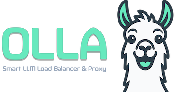
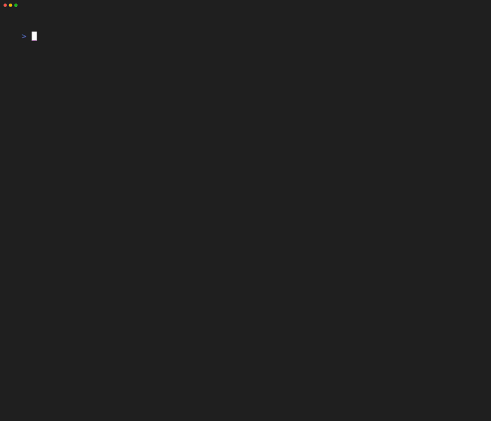
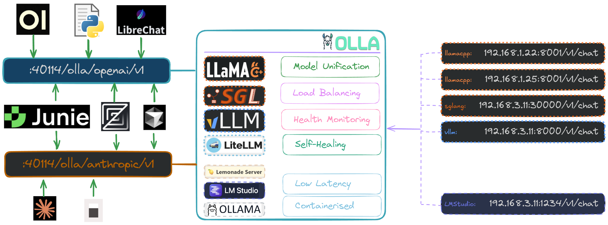

<div align="center">
    
  <p>
    <a href="https://github.com/thushan/olla/blob/master/LICENSE"></a>
    <a href="https://golang.org/"></a>
    <a href="https://github.com/thushan/olla/actions/workflows/ci.yml"></a>
    <a href="https://goreportcard.com/report/github.com/thushan/olla"></a>
    <a href="https://github.com/thushan/olla/releases/latest"></a> <br />
    <a href="https://github.com/ggerganov/llama.cpp"></a>
    <a href="https://github.com/vllm-project/vllm"></a>
    <a href="https://github.com/sgl-project/sglang"></a>
    <a href="https://github.com/BerriAI/litellm"></a>
    <a href="https://github.com/InternLM/lmdeploy"></a> <br/> 
    <a href="https://github.com/waybarrios/vllm-mlx/"></a>
    <a href="https://docs.docker.com/ai/model-runner/"></a><br/>
    <a href="https://ollama.com"></a>
    <a href="https://lmstudio.ai/"></a>
    <a href="https://github.com/lemonade-sdk/lemonade"></a>    
  </P>
  <p>
    <div align="center">
    <br/>
    <small>Recorded with <a href="https://vhs.charm.sh/">VHS</a> - see <a href="./docs/vhs/demo.tape">demo tape</a></small><br/><br/>
    </div>
    <a href="https://thushan.github.io/olla/"></a>
    &nbsp;
    <a href="https://github.com/thushan/olla/issues"></a>
    &nbsp;
    <a href="https://github.com/thushan/olla/releases"></a>
  </p>
</div>

> [!IMPORTANT]  
> Olla is currently **in active-development**. While it is usable, we are still finalising some features and optimisations. 
> Your feedback is invaluable! Open <a href="https://github.com/thushan/olla/issues">an issue</a> and let us know features you'd like to see in the future.

Olla is a high-performance, low-overhead, low-latency proxy and load balancer for managing LLM infrastructure. It intelligently routes LLM requests across local and remote inference nodes with a [wide variety](https://thushan.github.io/olla/integrations/overview/) of natively supported endpoints and extensible enough to support others. Olla provides model discovery and unified model catalogues within each provider, enabling seamless routing to available models on compatible endpoints.

Olla works alongside API gateways like [LiteLLM](https://github.com/BerriAI/litellm) or orchestration platforms like [GPUStack](https://github.com/gpustack/gpustack), focusing on making your **existing** LLM infrastructure reliable through intelligent routing and failover. You can choose between two proxy engines: **Sherpa** for simplicity and maintainability or **Olla** for maximum performance with advanced features like circuit breakers and connection pooling.



Single CLI application and config file is all you need to go Olla!

## Key Features

- **🔄 Smart Load Balancing**: [Priority-based routing](https://thushan.github.io/olla/concepts/load-balancing/) with automatic failover and connection retry
- **🔍 Smart Model Unification**: [Per-provider unification + OpenAI-compatible cross-provider routing](https://thushan.github.io/olla/concepts/model-unification/)
- **⚡ Dual Proxy Engines**: [Sherpa (simple) and Olla (high-performance)](https://thushan.github.io/olla/concepts/proxy-engines/)
- **🎯 Advanced Filtering**: [Profile and model filtering](https://thushan.github.io/olla/configuration/filters/) with glob patterns for precise control
- **💊 Health Monitoring**: [Continuous endpoint health checks](https://thushan.github.io/olla/concepts/health-checking/) with circuit breakers and automatic recovery
- **🔁 Intelligent Retry**: Automatic retry on connection failures with immediate transparent endpoint failover
- **🔧 Self-Healing**: Automatic model discovery refresh when endpoints recover
- **📊 Request Tracking**: Detailed response headers and [statistics](https://thushan.github.io/olla/api-reference/overview/#response-headers)
- **⚡🔄 Anthropic Messages API**: [Passthrough for backends with native support; automatic translation for others](https://thushan.github.io/olla/integrations/api-translation/anthropic/)
- **🛡️ Production Ready**: Rate limiting, request size limits, graceful shutdown
- **⚡ High Performance**: Sub-millisecond endpoint selection with lock-free atomic stats
- **🎯 LLM-Optimised**: Streaming-first design with optimised timeouts for long inference
- **⚙️ High Performance**: Designed to be very [lightweight & efficient](https://thushan.github.io/olla/configuration/practices/performance/), runs on less than 50Mb RAM.

## Platform Support

Olla runs on multiple platforms and architectures:

| Platform | AMD64 | ARM64 | Notes |
|----------|-------|-------|-------|
| Linux    | ✅ | ✅ | Full support including Raspberry Pi 4+ |
| macOS    | ✅ | ✅ | Intel and Apple Silicon (M1/M2/M3/M4) |
| Windows  | ✅ | ✅ | Windows 10/11 and Windows on ARM |
| Docker   | ✅ | ✅ | Multi-architecture images (amd64/arm64) |

## Quick Start

### Installation

```bash
# Download latest release (auto-detects your platform)
bash <(curl -s https://raw.githubusercontent.com/thushan/olla/main/install.sh)
```
```bash
# Docker (automatically pulls correct architecture)
docker run -t \
  --name olla \
  -p 40114:40114 \
  ghcr.io/thushan/olla:latest

# Or explicitly specify platform (e.g., for ARM64)
docker run --platform linux/arm64 -t \
  --name olla \
  -p 40114:40114 \
  ghcr.io/thushan/olla:latest
```
```bash
# Install via Go
go install github.com/thushan/olla@latest
```
```bash
# Build from source
git clone https://github.com/thushan/olla.git && cd olla && make build-release
# Run Olla
./bin/olla
```

### Verification

When you have everything running, you can check it's all working with:

```bash
# Check health of Olla
curl http://localhost:40114/internal/health

# Check endpoints
curl http://localhost:40114/internal/status/endpoints

# Check models available
curl http://localhost:40114/internal/status/models
```

For detailed installation and deployment options, see [Getting Started Guide](https://thushan.github.io/olla/getting-started/quickstart/).

### Querying Olla

Olla exposes multiple API paths depending on your use case:

| Path | Format | Use Case |
|------|--------|----------|
| `/olla/proxy/` | OpenAI | Routes to any backend — universal endpoint |
| `/olla/openai/` | OpenAI | Routes to any backend — universal endpoint |
| `/olla/anthropic/` | Anthropic | Claude-compatible clients (passthrough or translated) |
| `/olla/{provider}/` | OpenAI | Target a specific backend type (e.g. `/olla/vllm/`, `/olla/ollama/`) |

#### OpenAI-Compatible (Universal Proxy)

You can use `/olla/openai` or `/olla/proxy`

```bash
# Chat completion (routes to best available backend)
curl http://localhost:40114/olla/proxy/v1/chat/completions \
  -H "Content-Type: application/json" \
  -d '{"model": "llama3.2", "messages": [{"role": "user", "content": "Hello"}], "max_tokens": 100}'

# Streaming
curl http://localhost:40114/olla/proxy/v1/chat/completions \
  -H "Content-Type: application/json" \
  -d '{"model": "llama3.2", "messages": [{"role": "user", "content": "Hello"}], "max_tokens": 100, "stream": true}'

# List all models across backends
curl http://localhost:40114/olla/proxy/v1/models
```

#### Anthropic Messages API

```bash
# Chat completion (passthrough for supported backends, translated for others)
curl http://localhost:40114/olla/anthropic/v1/messages \
  -H "Content-Type: application/json" \
  -H "x-api-key: not-needed" \
  -H "anthropic-version: 2023-06-01" \
  -d '{"model": "llama3.2", "max_tokens": 100, "messages": [{"role": "user", "content": "Hello"}]}'

# Streaming
curl http://localhost:40114/olla/anthropic/v1/messages \
  -H "Content-Type: application/json" \
  -H "x-api-key: not-needed" \
  -H "anthropic-version: 2023-06-01" \
  -d '{"model": "llama3.2", "max_tokens": 100, "messages": [{"role": "user", "content": "Hello"}], "stream": true}'
```

#### Provider-Specific Endpoints

```bash
# Target a specific backend type directly
curl http://localhost:40114/olla/ollama/v1/chat/completions \
  -H "Content-Type: application/json" \
  -d '{"model": "llama3.2", "messages": [{"role": "user", "content": "Hello"}], "max_tokens": 100}'

# Other providers: /olla/vllm/, /olla/vllm-mlx/, /olla/lm-studio/, /olla/llamacpp/, etc.
```

## Examples

We've also got ready-to-use Docker Compose setups for common scenarios:

### Common Architectures

- **Home Lab**: Olla → Multiple Ollama (or OpenAI Compatible - eg. vLLM) instances across your machines
- **Hybrid Cloud**: Olla → Local endpoints + LiteLLM → Cloud APIs (OpenAI, Anthropic, Bedrock, etc.)
- **Enterprise**: Olla → GPUStack cluster + vLLM servers + LiteLLM (cloud overflow)
- **Development**: Olla → Local + Shared team endpoints + LiteLLM (API access)

See [integration patterns](https://thushan.github.io/olla/compare/integration-patterns/) for detailed architectures.

For a robust enterprise setup, consider [TensorFoundry FoundryOS](https://tensorfoundry.io/products/foundryos).

### 🌐 **OpenWebUI Integration**

Complete setup with [OpenWebUI](https://github.com/open-webui/open-webui) + Olla load balancing multiple [Ollama instances](https://thushan.github.io/olla/integrations/frontend/openwebui/) or unify all [OpenAI compatible models](https://thushan.github.io/olla/integrations/frontend/openwebui-openai/).

- **See**: [`examples/ollama-openwebui/`](examples/ollama-openwebui/)
- **Services**: OpenWebUI (web UI) + Olla (proxy/load balancer)  
- **Use Case**: Web interface with intelligent load balancing across multiple Ollama servers with Olla
- **Quick Start**: 
  ```bash
  cd examples/ollama-openwebui
  # Edit olla.yaml to configure your Ollama endpoints
  docker compose up -d
  # Access OpenWebUI at http://localhost:3000
  ```

You can learn more about [OpenWebUI Ollama with Olla](https://thushan.github.io/olla/integrations/frontend/openwebui/) or see [OpenWebUI OpenAI with Olla](https://thushan.github.io/olla/integrations/frontend/openwebui-openai/).

### 🤖 **Anthropic Message API / CLI Tools - Claude Code, OpenCode, Crush**

Olla's Anthropic Messages API support (v0.0.20+) is **enabled by default**, allowing you to use CLI tools like Claude Code with local AI models on your machine via `/olla/anthropic`. It operates in two modes depending on your backend:

- ⚡ **Passthrough**: requests are forwarded as-is for backends with native Anthropic support (vLLM, llama.cpp, Ollama, LM Studio, Lemonade)
- 🔄 **Translation**: Anthropic ↔ OpenAI format conversion for backends that don't natively support the Anthropic Messages API

Still actively being improved -- please report any issues or feedback.

We have examples for:

* [Claude Code](https://thushan.github.io/olla/integrations/frontend/claude-code/)
* [OpenCode](https://thushan.github.io/olla/integrations/frontend/opencode/)
* [Crush](https://thushan.github.io/olla/integrations/frontend/crush-cli/)

Learn more about [Anthropic API Translation](https://thushan.github.io/olla/integrations/api-translation/anthropic/).

## Documentation

Full documentation is available at **[https://thushan.github.io/olla/](https://thushan.github.io/olla/)**

* **[Getting Started](https://thushan.github.io/olla/getting-started/installation/)** - Getting Started with Olla
* **[Integrations](https://thushan.github.io/olla/integrations/overview/)** -  See which LLM backends are supported by Olla
* **[Comparisons](https://thushan.github.io/olla/compare/overview/)** - Compare with LiteLLM, GPUStack, LocalAI
* **[Olla Concepts](https://thushan.github.io/olla/concepts/overview/)** - Understand Key Olla concepts
* **[Configuration](https://thushan.github.io/olla/configuration/overview/)** - Extensive configuration documentation
* **[API Reference](https://thushan.github.io/olla/api-reference/overview/)** - Olla System API Reference
* **[Development](https://thushan.github.io/olla/development/overview/)** - Contributing and development guide

## 🤝 Contributing

We welcome contributions! Please open an issue first to discuss major changes.

## 🤖 AI Disclosure

This project has been built with the assistance of AI tools for documentation, test refinement, and code reviews.

We've utilised GitHub Copilot, Anthropic Claude, Jetbrains Junie, Codex & TensorFoundry Kaizen for documentation, code reviews, test refinement and troubleshooting.

We also utilise [CodeRabbit](https://www.coderabbit.ai/) for AI-driven code reviews for PRs prior to human review.

## 🙏 Acknowledgements

* [@pterm/pterm](https://github.com/pterm/pterm) - Terminal UI framework
* [@puzpuzpuz/xsync](https://github.com/puzpuzpuz/xsync/) - High-performance concurrent maps
* [@golangci/golangci-lint](https://github.com/golangci/golangci-lint) - Go linting
* [@dkorunic/betteralign](https://github.com/dkorunic/betteralign) - Struct alignment optimisation

## 📄 License

Licensed under the Apache License 2.0. See [LICENSE](LICENSE) for details.

---

<div align="center">

**Made with ❤️ for the LLM community**

[🏠 Homepage](https://github.com/thushan/olla) • [📖 Documentation](https://thushan.github.io/olla/) • [🐛 Issues](https://github.com/thushan/olla/issues) • [🚀 Releases](https://github.com/thushan/olla/releases)


</div>
