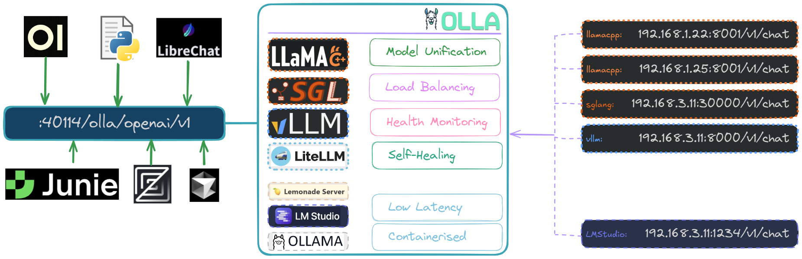

<div align="center">
    
  <p>
    <a href="https://github.com/thushan/olla/blob/master/LICENSE"></a>
    <a href="https://golang.org/"></a>
    <a href="https://github.com/thushan/olla/actions/workflows/ci.yml"></a>
    <a href="https://goreportcard.com/report/github.com/thushan/olla"></a>
    <a href="https://github.com/thushan/olla/releases/latest"></a> <br />
    <a href="https://github.com/ggerganov/llama.cpp"></a>
    <a href="https://github.com/vllm-project/vllm"></a>
    <a href="https://github.com/sgl-project/sglang"></a>
    <a href="https://github.com/BerriAI/litellm"></a>
    <a href="https://github.com/InternLM/lmdeploy"></a> <br/>
    <a href="https://ollama.com"></a>
    <a href="https://lmstudio.ai/"></a>
    <a href="https://github.com/lemonade-sdk/lemonade"></a>    
  </P>
  <p>
    <div align="center">
    <br/>
    <small>Recorded with <a href="https://vhs.charm.sh/">VHS</a> - see <a href="./docs/vhs/demo.tape">demo tape</a></small><br/><br/>
    </div>
    <a href="https://thushan.github.io/olla/"></a>
    &nbsp;
    <a href="https://github.com/thushan/olla/issues"></a>
    &nbsp;
    <a href="https://github.com/thushan/olla/releases"></a>
  </p>
</div>

> [!IMPORTANT]  
> Olla is currently **in active-development**. While it is usable, we are still finalising some features and optimisations. 
> Your feedback is invaluable! Open <a href="https://github.com/thushan/olla/issues">an issue</a> and let us know features you'd like to see in the future.

Olla is a high-performance, low-overhead, low-latency proxy and load balancer for managing LLM infrastructure. It intelligently routes LLM requests across local and remote inference nodes with a [wide variety](https://thushan.github.io/olla/integrations/overview/) of natively supported endpoints and extensible enough to support others. Olla provides model discovery and unified model catalogues within each provider, enabling seamless routing to available models on compatible endpoints.

Olla works alongside API gateways like [LiteLLM](https://github.com/BerriAI/litellm) or orchestration platforms like [GPUStack](https://github.com/gpustack/gpustack), focusing on making your **existing** LLM infrastructure reliable through intelligent routing and failover. You can choose between two proxy engines: **Sherpa** for simplicity and maintainability or **Olla** for maximum performance with advanced features like circuit breakers and connection pooling.



Single CLI application and config file is all you need to go Olla!

## Key Features

- **🔄 Smart Load Balancing**: [Priority-based routing](https://thushan.github.io/olla/concepts/load-balancing/) with automatic failover and connection retry
- **🔍 Smart Model Unification**: [Per-provider unification + OpenAI-compatible cross-provider routing](https://thushan.github.io/olla/concepts/model-unification/)
- **⚡ Dual Proxy Engines**: [Sherpa (simple) and Olla (high-performance)](https://thushan.github.io/olla/concepts/proxy-engines/)
- **🎯 Advanced Filtering**: [Profile and model filtering](https://thushan.github.io/olla/configuration/filters/) with glob patterns for precise control
- **💊 Health Monitoring**: [Continuous endpoint health checks](https://thushan.github.io/olla/concepts/health-checking/) with circuit breakers and automatic recovery
- **🔁 Intelligent Retry**: Automatic retry on connection failures with immediate transparent endpoint failover
- **🔧 Self-Healing**: Automatic model discovery refresh when endpoints recover
- **📊 Request Tracking**: Detailed response headers and [statistics](https://thushan.github.io/olla/api-reference/overview/#response-headers)
- **🛡️ Production Ready**: Rate limiting, request size limits, graceful shutdown
- **⚡ High Performance**: Sub-millisecond endpoint selection with lock-free atomic stats
- **🎯 LLM-Optimised**: Streaming-first design with optimised timeouts for long inference
- **⚙️ High Performance**: Designed to be very [lightweight & efficient](https://thushan.github.io/olla/configuration/practices/performance/), runs on less than 50Mb RAM.

## Platform Support

Olla runs on multiple platforms and architectures:

| Platform | AMD64 | ARM64 | Notes |
|----------|-------|-------|-------|
| Linux    | ✅ | ✅ | Full support including Raspberry Pi 4+ |
| macOS    | ✅ | ✅ | Intel and Apple Silicon (M1/M2/M3/M4) |
| Windows  | ✅ | ✅ | Windows 10/11 and Windows on ARM |
| Docker   | ✅ | ✅ | Multi-architecture images (amd64/arm64) |

## Quick Start

### Installation

```bash
# Download latest release (auto-detects your platform)
bash <(curl -s https://raw.githubusercontent.com/thushan/olla/main/install.sh)
```
```bash
# Docker (automatically pulls correct architecture)
docker run -t \
  --name olla \
  -p 40114:40114 \
  ghcr.io/thushan/olla:latest

# Or explicitly specify platform (e.g., for ARM64)
docker run --platform linux/arm64 -t \
  --name olla \
  -p 40114:40114 \
  ghcr.io/thushan/olla:latest
```
```bash
# Install via Go
go install github.com/thushan/olla@latest
```
```bash
# Build from source
git clone https://github.com/thushan/olla.git && cd olla && make build-release
# Run Olla
./bin/olla
```

When you have everything running, you can check it's all working with:

```bash
# Check health of Olla
curl http://localhost:40114/internal/health

# Check endpoints
curl http://localhost:40114/internal/status/endpoints

# Check models available
curl http://localhost:40114/internal/status/models
```

For detailed installation and deployment options, see [Getting Started Guide](https://thushan.github.io/olla/getting-started/quickstart/).

## Examples

We've also got ready-to-use Docker Compose setups for common scenarios:

### Common Architectures

- **Home Lab**: Olla → Multiple Ollama (or OpenAI Compatible - eg. vLLM) instances across your machines
- **Hybrid Cloud**: Olla → Local endpoints + LiteLLM → Cloud APIs (OpenAI, Anthropic, Bedrock, etc.)
- **Enterprise**: Olla → GPUStack cluster + vLLM servers + LiteLLM (cloud overflow)
- **Development**: Olla → Local + Shared team endpoints + LiteLLM (API access)

See [integration patterns](https://thushan.github.io/olla/compare/integration-patterns/) for detailed architectures.

### 🌐 **OpenWebUI Integration**

Complete setup with [OpenWebUI](https://github.com/open-webui/open-webui) + Olla load balancing multiple [Ollama instances](https://thushan.github.io/olla/integrations/frontend/openwebui/) or unify all [OpenAI compatible models](https://thushan.github.io/olla/integrations/frontend/openwebui-openai/).

- **See**: [`examples/ollama-openwebui/`](examples/ollama-openwebui/)
- **Services**: OpenWebUI (web UI) + Olla (proxy/load balancer)  
- **Use Case**: Web interface with intelligent load balancing across multiple Ollama servers with Olla
- **Quick Start**: 
  ```bash
  cd examples/ollama-openwebui
  # Edit olla.yaml to configure your Ollama endpoints
  docker compose up -d
  # Access OpenWebUI at http://localhost:3000
  ```

You can learn more about [OpenWebUI Ollama with Olla](https://thushan.github.io/olla/integrations/frontend/openwebui/) or see [OpenWebUI OpenAI with Olla](https://thushan.github.io/olla/integrations/frontend/openwebui-openai/).

### 🤖 **Anthropic Message API / CLI Tools - Claude Code, OpenCode, Crush**

> [!CAUTION]
> Introduced in v0.0.20+, the Anthropic implementation is *experimental* and should be used with caution.

You can use CLI tools with Olla by using the new Anthropic Message API at `/olla/anthropic` to run Claude Code with Local AI models you have on your machine.

We have examples for:

* [Claude Code](https://thushan.github.io/olla/integrations/frontend/claude-code/)
* [OpenCode](https://thushan.github.io/olla/integrations/frontend/opencode/)
* [Crush](https://thushan.github.io/olla/integrations/frontend/crush-cli/)

Learn more about [Anthropic API Translation](https://thushan.github.io/olla/integrations/api-translation/anthropic/).

## Documentation

Full documentation is available at **[https://thushan.github.io/olla/](https://thushan.github.io/olla/)**

* **[Getting Started](https://thushan.github.io/olla/getting-started/installation/)** - Getting Started with Olla
* **[Integrations](https://thushan.github.io/olla/integrations/overview/)** -  See which LLM backends are supported by Olla
* **[Comparisons](https://thushan.github.io/olla/compare/overview/)** - Compare with LiteLLM, GPUStack, LocalAI
* **[Olla Concepts](https://thushan.github.io/olla/concepts/overview/)** - Understand Key Olla concepts
* **[Configuration](https://thushan.github.io/olla/configuration/overview/)** - Extensive configuration documentation
* **[API Reference](https://thushan.github.io/olla/api-reference/overview/)** - Olla System API Reference
* **[Development](https://thushan.github.io/olla/development/overview/)** - Contributing and development guide

## 🤝 Contributing

We welcome contributions! Please open an issue first to discuss major changes.

## 🤖 AI Disclosure

This project has been built with the assistance of AI tools for documentation, test refinement, and code reviews.

We've utilised GitHub Copilot, Anthropic Claude, Jetbrains Junie and OpenAI ChatGPT for documentation, code reviews, test refinement and troubleshooting.

## 🙏 Acknowledgements

* [@pterm/pterm](https://github.com/pterm/pterm) - Terminal UI framework
* [@puzpuzpuz/xsync](https://github.com/puzpuzpuz/xsync/) - High-performance concurrent maps
* [@golangci/golangci-lint](https://github.com/golangci/golangci-lint) - Go linting
* [@dkorunic/betteralign](https://github.com/dkorunic/betteralign) - Struct alignment optimisation

## 📄 License

Licensed under the Apache License 2.0. See [LICENSE](LICENSE) for details.

## 🎯 Roadmap

- [x] **Circuit breakers**: Advanced fault tolerance (Olla engine)
- [x] **Connection pooling**: Per-endpoint connection management (Olla engine)
- [x] **Object pooling**: Reduced GC pressure for high throughput (Olla engine)
- [X] **Model routing**: Route based on model requested
- [ ] **Authenticated Endpoints**: Support calling authenticated endpoints (bearer) like OpenAI/Groq/OpenRouter as endpoints
- [ ] **Auto endpoint discovery**: Add endpoints, let Olla determine the type
- [ ] **Model benchmarking**: Benchmark models across multiple endpoints easily
- [ ] **Metrics export**: Prometheus/OpenTelemetry integration
- [ ] **Dynamic configuration**: API-driven endpoint management
- [ ] **TLS termination**: Built-in SSL support
- [ ] **Olla Admin Panel**: View Olla metrics easily within the browser
- [ ] **Model caching**: Intelligent model preloading
- [ ] **Advanced Connection Management**: Authenticated endpoints (via SSH tunnels, OAuth, Tokens)
- [ ] **OpenRouter Support**: Support OpenRouter calls within Olla (divert to free models on OpenRouter etc)

Let us know what you want to see!

---

<div align="center">

**Made with ❤️ for the LLM community**

[🏠 Homepage](https://github.com/thushan/olla) • [📖 Documentation](https://thushan.github.io/olla/) • [🐛 Issues](https://github.com/thushan/olla/issues) • [🚀 Releases](https://github.com/thushan/olla/releases)


</div>
